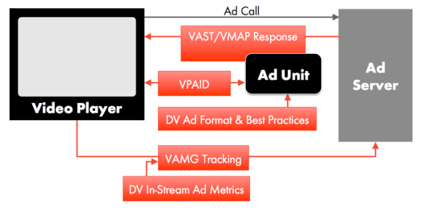
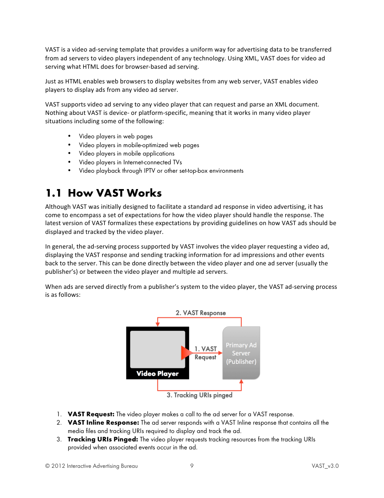
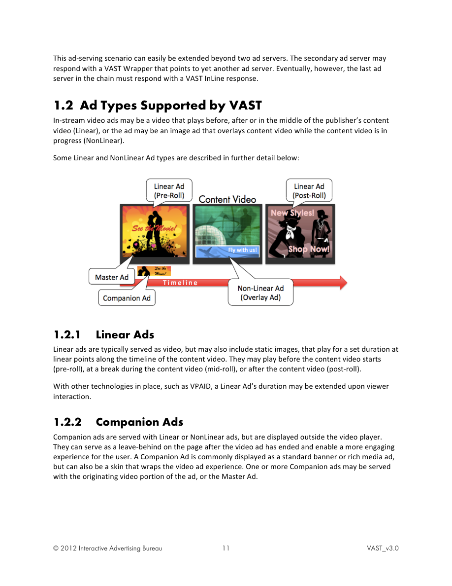
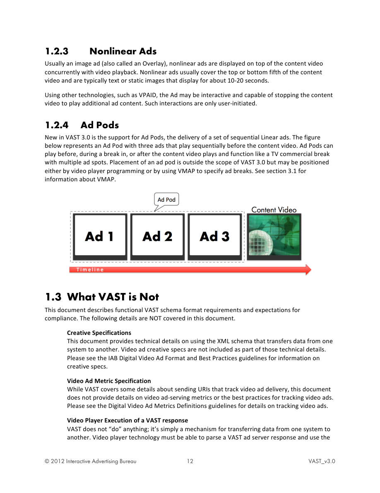
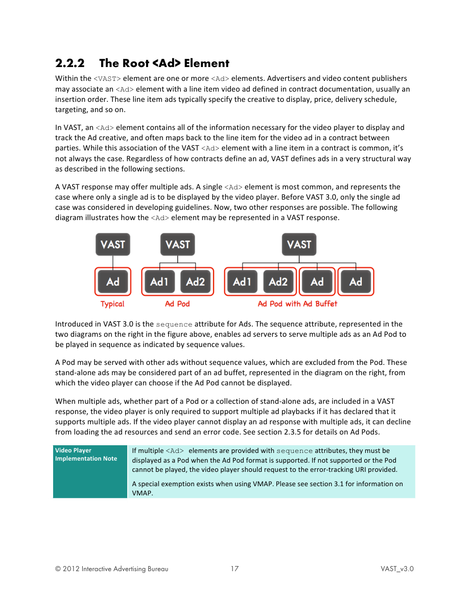
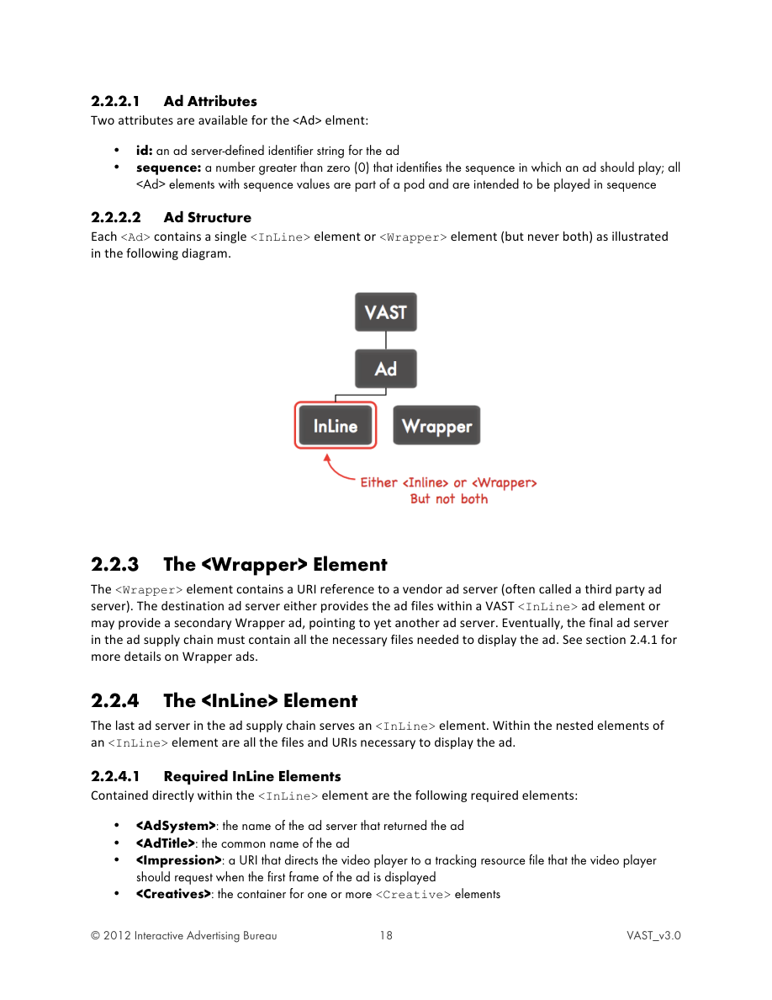

<!-- Converted from VASTv3_0.pdf. See conversion audit log for OCR cleanup and editorial decisions. -->

# Video Ad Serving Template (VAST)

Version 3.0

Published July 19, 2012

This document has been developed by the IAB Digital Video Committee

The Video Ad Serving Template (VAST) specification was updated to version 3.0 by a working group of volunteers from 42 IAB member companies.

The VAST Working Group was led by:

- Teg Grenager, Adap.tv
- Payam Shodjai, Google/YouTube

The following IAB member companies contributed to this document:
||||
|---|---|---|
| 24/7 Real Media | FreeWheel | Ooyala |
| Adap.tv | Google & YouTube | PointRoll |
| Adobe Systems | HealthiNation | SeaChange International |
| AppNexus | ImServices Group Ltd. | SpotXchange |
| Auditude | Innovid, Inc. | TargetSpot |
| BlackArrow | Kantar Video | Tremor Video |
| Brightcove | LiveRail, Inc. | TRUSTe |
| Brightroll | MediaMind | TubeMogul |
| Cable Television | Microsoft | Turner Broadcasting System |
| Laboratories, Inc. | Mixpo | Unicast |
| CBS Interactive | NBC Universal | Digital Media Vindico |
| Comcast Interactive Media | New York Times | Weather.com |
| Digital Broadcasting Group | Nielsen | Yahoo! |
| Evidon | OneScreen | YuMe |

The IAB leads on this initiative were Chris Mejia and Katie Stroud

Contact adtechnology@iab.net to comment on this document. Please be sure to include the version number of this document (found on the bottom right corner on this page).

ABOUT THE IAB'S DIGITAL VIDEO COMMITTEE
The Digital Video Committee of the IAB is comprised of over 180 member companies actively engaged in the creation and execution of digital video advertising. One of the goals of the committee is to implement a comprehensive set of guidelines, measurement, and creative options for interactive video advertising. The Committee works to educate marketers and agencies on the strength of digital video as a marketing vehicle. A full list of Committee member companies can be found at: www.iab.net/digital_video_committee

This document is on the IAB website at: http://www.iab.net/vsuite/vast

<!-- If we match TOC from .pdf it goes here -->

## Executive Summary
The IAB's Video Ad Serving Template (VAST) specification is a universal XML schema for serving ads to digital video players, and describes expected video player behavior when executing VAST-formatted ad responses. VAST 3.0 adds critical functionality that opens up the in-stream digital video advertising marketplace, reducing expensive technical barriers and encouraging advertisers to increase video ad spend.

As online video content publishing has become more common, video publishers have sought to monetize their content with in-stream video advertising. Before VAST, there was not a common in-stream advertising protocol for video players, which made scalable distribution of ads impossible for ad servers. In order to serve ads to multiple publishers using disparate proprietary video players, ad-serving organizations had to develop slightly different ad responses for every publisher/video player targeted. This approach was expensive and didn't easily scale.

VAST provides a common protocol that enables ad servers to use a single ad response format across multiple publishers/video players. In 2008, the IAB introduced the first version of VAST to the video advertising marketplace, which has since been widely adopted throughout the industry. In 2009 features were added that enabled additional functionality and more clarity. Today, as the in-stream digital video advertising market becomes more sophisticated, additional features and functionality are required to improve support for in-stream ad display and reporting.

VAST 3.0 provides more features, increased functionality and better reporting, while maintaining backward compatibility with VAST 2.0 to ensure a smooth transition for the industry. VAST 3.0 provides additional detail for the ad response format and the expected behavior of video players.

With VAST 3.0, video players now have the ability to declare which ad formats they support. Five formats are provided as options: Linear Ads, NonLinear Ads, Skippable Linear Ads, Linear Ads with Companions, and Ad Pods (a sequenced group of ads). Skippable Linear Ads and Ad Pods are new formats offered with this release. Some video players choose to only support certain VAST ad formats in accordance with their publishing business model. With VAST 3.0, the guesswork of which VAST ad format a player supports is eliminated.

Video content publishers should upgrade their video players to support VAST 3.0 ad responses according to the ad formats they support. These video players should also adhere to the expected behaviors defined in this document. Additionally, ad-serving organizations should ensure that their VAST 3.0 ad responses are well formatted and adhere to the specifications outlined in this document.

As with all IAB guidelines and specifications, this document will be updated as in-stream video advertising progresses and new ad formats become more widely adopted.

## Intended Audience
Anyone involved in the in-stream (also referred to as "in-player") video ad supply chain can benefit from being familiar with these guidelines, but implementation details are targeted toward video player developers and video ad-serving organizations. Specifically, video software engineers and video product managers should use this document as a guide when implementing technology designed to support a VAST ad response.

## IAB Video Guidelines
The incredible growth of online video has been accompanied by a steep rise in video advertising spend. To facilitate this spend, the IAB Digital Video Committee has brought together publishers, agencies and vendors to create a set of video advertising specifications that establish a common framework for communication between ad servers and video players. Six sets of IAB guidelines have been developed to help improve video advertising:

- Video Ad Measurement Guidelines (VAMG): Outlines how events should be tracked.
- Video Ad Serving Template (VAST): Enables the common structure of a video ad response sent from an ad server to a video player.
- Video Player Ad Interface Definition (VPAID): Establishes the communication protocol between an interactive ad and the video player that is rendering it.
- Video Multi Ads Playlist (VMAP): Enable a structure for a playlist of video ads sent from an ad server to a video player.
- Digital Video Ad Format Guidelines and Best Practices: Outlines the general format and best practices that video ads should adhere to for the best advertising experience.
- Digital Video In-Stream Ad Metrics Definitions: Defines industry-accepted metrics for measuring video ad effectiveness.

The following diagram explains the relationship between these guidelines and the video ad serving process.



## Updates in VAST 3.0
VAST has been widely adopted in the industry, but certain limitations foster messy work-arounds to
meet the needs of the industry. Updates in VAST 3.0 were designed to provide support for emerging
practices in video advertising, along with variable compliance formats that companies can choose to
support while remaining compliant with VAST 3.0 guidelines.

- NonLinear Wrapper Change: NonLinear resource files are not needed in a Wrapper VAST response. VAST 3.0 clarifies the difference between an InLine NonLinear creative and a Wrapper NonLinear creative. Only tracking elements are relevant for a Wrapper NonLinear.
- Compliance Formats: VAST supports five different ad formats. Publishers don't need to support all five models to be compliant with VAST 3.0. In VAST 3.0 video content publishers can declare support for one or more VAST ad formats while maintaining minimal guidelines for compliance.
- Support for Ad Pods: Using a sequence attribute on the &lt;Ad&gt; element, you can format a VAST response that groups multiple ads into a sequential pod of ads.
- Support for Skippable Linear Ads: An optional ad-serving model for ads that viewers can skip enables publishers to support a business model in which publishers and advertisers can negotiate billing based on ads that play all the way through.
- Support for in-ads privacy notice: When multiple ad servers are involved in video advertising, displaying an in-ads privacy notice to support Online Behavioral Advertising (OBA) Self-Regulation can be difficult. VAST 3.0 shares best practice guidelines for handling in-ads privacy notices.
- Better error reporting: An improved list of error codes enables video players to report more specific details when ads don't serve properly. The resulting troubleshooting data can help improve
video advertising technology over time.
- More tracking events: Some tracking events and attributes have been added to provide more details about served ads and to support new ad formats such as Skippable Ads.

VAST 3.0 is designed to be able to receive and play responses formatted as VAST 2.0 and higher. This
means that:

- New VAST 3.0 players will continue to render VAST 2.0 ads and also support full backwards compatibility (to the extent possible) of future VAST versions.
- Video players that understand VAST 2.0 can display VAST 3.0 ads, if they relax their schema and version checks and do not fail on unknown attributes or elements.
- VAST 2.0 Wrappers can point to VAST 3.0 responses and VAST 3.0 Wrappers can point to VAST 2.0 responses.
- VAST 1.0 is deprecated, meaning that the IAB no longer supports it.

In addition, to VAST 3.0 updates, this document has been overhauled with expanded explanations of schema features and expectations. Implementation notes specific to ad server or video player implementation have been added to help call out important details about technology and expectations.

## 1 General Overview
In online advertising where browsers are used to display ads, tracking ad interactions is made possible using HTML to send data across the many networks and servers that may be involved. However, in video advertising, a video player is not a browser and may not use HTML. Video players are built on a variety of different technologies, each using their own instance of the technology.

If ad servers want to serve ads to video players, they have to develop ad tags designed to display ads based on the technology of each video player they want to serve to. Complicating matters is that multiple servers may be required as part of the process to serve ads, requiring each to provide specialized ad display information.

VAST is a video ad-serving template that provides a uniform way for advertising data to be transferred from ad servers to video players independent of any technology. Using XML, VAST does for video ad serving what HTML does for browser-based ad serving.

Just as HTML enables web browsers to display websites from any web server, VAST enables video players to display ads from any video ad server.

VAST supports video ad serving to any video player that can request and parse an XML document. Nothing about VAST is device- or platform-specific, meaning that it works in many video player situations including some of the following:

- Video players in web pages
- Video players in mobile-optimized web pages
- Video players in mobile applications
- Video players in Internet-connected TVs
- Video playback through IPTV or other set-top-box environments

### 1.1 How VAST Works
Although VAST was initially designed to facilitate a standard ad response in video advertising, it has come to encompass a set of expectations for how the video player should handle the response. The latest version of VAST formalizes these expectations by providing guidelines on how VAST ads should be displayed and tracked by the video player.

In general, the ad-serving process supported by VAST involves the video player requesting a video ad, displaying the VAST response and sending tracking information for ad impressions and other events back to the server. This can be done directly between the video player and one ad server (usually the publisher's) or between the video player and multiple ad servers.

When ads are served directly from a publisher's system to the video player, the VAST ad-serving process is as follows:



1. VAST Request: The video player makes a call to the ad server for a VAST response.
2. VAST Inline Response: The ad server responds with a VAST Inline response that contains all the media files and tracking URIs required to display and track the ad.
3. Tracking URIs Pinged: The video player requests tracking resources from the tracking URIs provided when associated events occur in the ad.

In the scenario just described, only one ad server is involved. This commonly happens if a VAST campaign is directly booked in a publisher's ad server. The benefits of VAST become more apparent when multiple ad servers become part of the video ad serving process.

The diagram below illustrates the process for serving ads when a secondary ad server is involved:


1. VAST Request: The video player sends a request to the primary ad server.
2. VAST Redirect: During campaign set up, the advertising party (possibly an agency or network) sends a VAST Wrapper response identifying resources from a secondary ad server. The following example provides an excerpt of a VAST Wrapper response:
```xml
<VAST> <Ad> <Wrapper> …
<VASTAdTagURI>
http://SecondaryAdServer.vast.tag
</VASTAdTagURI>
…</Wrapper> </Ad> </VAST>
```
3. VAST Request: After parsing the VAST response, the video player sends a request to the secondary ad server using the URI provided in the primary VAST response from step 2.
4. VAST Inline Response: The secondary ad server sends a VAST response containing all the necessary details for the ad to be displayed. The example below shows the outlining VAST elements used for the inline response:
```xml
<VAST> <Ad> <InLine>
…
</InLine> </Ad> </VAST>
```
5. Tracking URIs Pinged: Upon triggering specified events for the ad, each of the ad servers are notified using the tracking URIs provided.

In the scenario above, two ad servers are involved. This scenario commonly occurs when one or more vendor ad servers become part of the process and where both parties want to receive all the tracking information.

This ad-serving scenario can easily be extended beyond two ad servers. The secondary ad server may respond with a VAST Wrapper that points to yet another ad server. Eventually, however, the last ad server in the chain must respond with a VAST InLine response.

### 1.2 Ad Types Supported by VAST
In-stream video ads may be a video that plays before, after or in the middle of the publisher's content video (Linear), or the ad may be an image ad that overlays content video while the content video is in progress (NonLinear).

Some Linear and NonLinear Ad types are described in further detail below:



#### 1.2.1 Linear Ads
Linear ads are typically served as video, but may also include static images, that play for a set duration at linear points along the timeline of the content video. They may play before the content video starts (pre-roll), at a break during the content video (mid-roll), or after the content video (post-roll).

With other technologies in place, such as VPAID, a Linear Ad's duration may be extended upon viewer interaction.

#### 1.2.2 Companion Ads
Companion ads are served with Linear or NonLinear ads, but are displayed outside the video player. They can serve as a leave-behind on the page after the video ad has ended and enable a more engaging experience for the user. A Companion Ad is commonly displayed as a standard banner or rich media ad, but can also be a skin that wraps the video ad experience. One or more Companion ads may be served with the originating video portion of the ad, or the Master Ad.

#### 1.2.3 Nonlinear Ads
Usually an image ad (also called an Overlay), nonlinear ads are displayed on top of the content video concurrently with video playback. Nonlinear ads usually cover the top or bottom fifth of the content video and are typically text or static images that display for about 10-20 seconds.

Using other technologies, such as VPAID, the Ad may be interactive and capable of stopping the content video to play additional ad content. Such interactions are only user-initiated.

#### 1.2.4 Ad Pods
New in VAST 3.0 is the support for Ad Pods, the delivery of a set of sequential Linear ads. The figure below represents an Ad Pod with three ads that play sequentially before the content video. Ad Pods can play before, during a break in, or after the content video plays and function like a TV commercial break with multiple ad spots. Placement of an ad pod is outside the scope of VAST 3.0 but may be positioned either by video player programming or by using VMAP to specify ad breaks. See section 3.1 for information about VMAP.



### 1.3 What VAST is Not
This document describes functional VAST schema format requirements and expectations for compliance. The following details are NOT covered in this document.

    <b>Creative Specifications</b>
    This document provides technical details on using the XML schema that transfers data from one system to another. Video ad creative specs are not included as part of those technical details. Please see the IAB Digital Video Ad Format and Best Practices guidelines for information on creative specs.

    <b>Video Ad Metric Specification</b>
    While VAST covers some details about sending URIs that track video ad delivery, this document does not provide details on video ad-serving metrics or the best practices for tracking video ads. Please see the Digital Video Ad Metrics Definitions guidelines for details on tracking video ads.

    <b>Video Player Execution of a VAST response</b>
    VAST does not "do" anything; it's simply a mechanism for transferring data from one system to another. Video player technology must be able to parse a VAST ad server response and use the data in accordance with the guidelines in this document. This document provides detailed requirements for the display of the video ads in a VAST response, but does not provide a concrete technical implementation. Video player engineers can use the information in this document to design and build a VAST-compliant video player, using whatever technology the engineer prefers to use.

## 2 VAST Implementation Details
This section provides detailed requirements for ad servers and video players that wish to consider themselves compliant with VAST guidelines, thus ensuring that any two VAST-compliant systems behave as expected and therefore interoperable. Both the general VAST concepts and the requirements for different ad formats are provided.

### 2.1 Compliance
VAST specifies both the format of the ad response and how the video player should handle the response. In order for VAST to be effective, both ad servers and video players must adopt the guidelines outlined in this document.

In general, the video player need only accept ads that it requests and ad server responses should be displayed in the ad format intended. For example, if a video player requests a NonLinear Ad but receives a Linear Ad, the video player is not expected to display the Linear Ad. Similarly, if a standard Linear Ad is requested but a Skippable Linear Ad is received, the video player is not expected to display the Skippable Linear Ad nor should the video player play the Skippable Ad as a Linear Ad (without skip controls).

Details for general support are included for each VAST Ad format in sections throughout this document.

#### 2.1.1 Ad Server
VAST-compliant ad servers must be able to serve ad responses that conform to the VAST XML schema defined in this document. Ad servers must also be able to receive the subsequent tracking and error requests that result from the video player's execution of the VAST ad response.

#### 2.1.2 Video Player
VAST-compliant video players must be able to display the ad in a VAST response according to the instructions provided by the VAST ad response and according the video player's declared format support, which includes:

- Rendering the ad asset(s) correctly
- Respecting ad server instructions in a VAST response including those of any subsequent ad servers called in a chain of VAST wrapper responses, providing the responses are VAST-compliant
- Responding to supported user-interactions
- Sending appropriate tracking information back to the ad server
- Supporting XML conventions such as standard comment syntax (i.e. acknowledge VAST comments in the standard XML syntax: &lt;!--comment--&gt;)

Details for proper ad display and VAST support are defined throughout this document.

##### 2.1.2.1 Requesting VAST Ad Format
In VAST 3.0, multiple formats are offered as options for VAST compliance. (See section 2.3 for details.) Publishers must declare which format(s) they support for compliance, but the video player should also be able to communicate which format it supports when requesting an ad. The mechanism to do this is outside the scope of VAST but should be considered.

##### 2.1.2.2 Imposing VAST Structure
Publishers are encouraged to set requirements (i.e. file size, video type, Companion specs, etc.) for what they will accept and display in their video players. Advertisers should always discuss publisher requirements when developing a video ad campaign.

However, when publishers also require that VAST ad responses include ONLY details for whatever meets their requirements, then the spirit of the cross-platform video ad delivery that VAST offers is lost.

For example, VAST offers a means for ad servers to include multiple media files: perhaps one for each video type that meets requirements for a variety of video players. Each video player can then parse the VAST response for the media file that meets Publisher requirements. Such a VAST response can be served across multiple video players without modification.

If, however, a publisher stipulates that a VAST ad tag contain ONLY the elements that are relevant to its requirements (i.e. only one media file that meets its requirements), then the VAST response can only be served to that publisher (and any others that happen to have the exact same requirements).

Limiting an ad server's ability to create dynamic VAST responses with details that meet a wide range of requirements greatly limits the benefits that VAST was designed to offer. While VAST guidelines don't restrict publishers from imposing specific VAST structure, this practice is not recommended. Instead, publishers should consider accepting any VAST response containing ad information that meets requirements and ignoring any details not supported.

#### 2.1.3 VAST Format Compliance
VAST covers several distinct video ad formats, but ad serving and video publisher organizations may not want to support all formats. For example, some vendors may choose to serve only Linear ads with Companions. Likewise, some publishers may only want to support NonLinear ads in their video players.

In VAST 3.0, five video ad formats are specified so that video-advertising organizations may be compliant with VAST while only supporting a selected subset of the ad formats.

The VAST compliance formats are as follows:

1. Linear Ads
2. NonLinear Ads
3. Companion Ads
4. Skippable Linear Ads
5. Ad Pods

A company wishing to display IAB's seal for VAST compliance must declare which of the five ad formats their technology supports.

|---|---|
| General Implementation Note | IAB VPAID and VMAP specs are excluded from the list of format compliance because both specs are independent of each other and of VAST. Compliance with one spec does not imply compliance with any of the other specs. Compliance for either spec must be separately declared. |

#### 2.1.4 Minimal Compliance
In addition, regardless of which VAST formats a company declares to comply with, all ad servers and video players must comply with a broad set of general VAST functionality that applies across all categories, including the following:

1. Inline and Wrapper Ads (to support multiple ad-serving vendors)
2. Tracking Events
3. Error Reporting
4. Industry Icons (such as for in-ads notice supporting OBA self-regulation)

When working with any VAST compliant technology, a company should be able to expect that all of the above general functionality is supported.

#### 2.1.5 Browser Security for Flash™ and JavaScript™
Modern browsers restrict Adobe Flash and JavaScript runtime environments from retrieving data from other servers. Since typical VAST responses come from other servers, measures must be taken for each:

##### 2.1.5.1 crossdomain.xml for Flash
To enable Flash video players to accept a VAST response, ad servers must provide a crossdomain.xml file at their root HTTP domain. For example, adserver.com should provide the file as follows: http://adserver.com/crossdomain.xml

Flash video players know to check the root domain of any server that sends it data.

The xml is a simple file that includes the following:
```xml
<cross-domain-policy>
<allow-access-from domain="*">
<cross-domain-policy>
```

The asterisks (*) value for the domain attribute enables any Flash video player to accept data from the server providing the crossdomain.xml file.

For more information, visit http://kb2.adobe.com/cps/142/tn_14213.html

##### 2.1.5.2 Cross Origin Resource Sharing (CORS) for JavaScript
In order for JavaScript video players to accept a VAST response, ad servers must include a CORS header in the http file that wraps the VAST response. 

The CORS header must be formatted as follows:
    Access-Control-Allow-Origin: &lt;origin header value&gt;
    Access-Control-Allow-Credentials: true

These HTTP headers allow an ads player on any origin to read the VAST response from the ad server origin. The value of Access-Control-Allow-Origin should be the value of the Origin header sent with the ad request.

Setting the Access-Control-Allow-Credentials header to true will ensure that cookies will be sent and received properly.

For more information, visit http://www.w3.org/TR/cors

#### 2.1.6 XML Namespace
Whenever VAST is used in conjunction with any other XML template, such as with VMAP or VAST extensions, a namespace should be declared for each so that the elements of one are not confused with the elements of another.

For more information, visit: http://www.w3.org/TR/REC-xml-names/

### 2.2 General VAST Document Structure
A VAST-compliant ad response is a well-formed XML document, compliant with XML 1.0 so that standard XML requirements such as character entities and &lt;!--XML comments--&gt; should be honored. It must also pass a schema check against the VAST 3.0 XML Schema Definition (XSD) that is distributed in conjunction with this document. Lastly, it must conform to certain additional dependencies that cannot be expressed in the VAST 3.0 XSD. These dependencies are outlined in this section and further described throughout this document.

#### 2.2.1 Declaring the VAST response
All VAST responses share the same general structure. Each VAST response is declared with &lt;VAST&gt; as its topmost element along with the version attribute indicating the official version with which the response is compliant. For example, a VAST 3.0 response is declared as follows:
```xml
<VAST version="3.0">
```

As with all XML documents, each element must be closed after details nested within the element are provided. The following example is a VAST response with one nested &lt;Ad&gt; element.
```xml
<VAST version="3.0">
<Ad>
<!--ad details go here-->
</Ad>
</VAST>
```

#### 2.2.2 The Root &lt;Ad&gt; Element
Within the &lt;VAST&gt; element are one or more &lt;Ad&gt; elements. Advertisers and video content publishers may associate an &lt;Ad&gt; element with a line item video ad defined in contract documentation, usually an insertion order. These line item ads typically specify the creative to display, price, delivery schedule, targeting, and so on.

In VAST, an &lt;Ad&gt; element contains all of the information necessary for the video player to display and track the Ad creative, and often maps back to the line item for the video ad in a contract between parties. While this association of the VAST &lt;Ad&gt; element with a line item in a contract is common, it's not always the case. Regardless of how contracts define an ad, VAST defines ads in a very structural way as described in the following sections.

A VAST response may offer multiple ads. A single &lt;Ad&gt; element is most common, and represents the case where only a single ad is to be displayed by the video player. Before VAST 3.0, only the single ad case was considered in developing guidelines. Now, two other responses are possible. The following diagram illustrates how the &lt;Ad&gt; element may be represented in a VAST response.



Introduced in VAST 3.0 is the sequence attribute for Ads. The sequence attribute, represented in the two diagrams on the right in the figure above, enables ad servers to serve multiple ads as an Ad Pod to be played in sequence as indicated by sequence values.

A Pod may be served with other ads without sequence values, which are excluded from the Pod. These stand-alone ads may be considered part of an ad buffet, represented in the diagram on the right, from which the video player can choose if the Ad Pod cannot be displayed.

When multiple ads, whether part of a Pod or a collection of stand-alone ads, are included in a VAST response, the video player is only required to support multiple ad playbacks if it has declared that it supports multiple ads. If the video player cannot display an ad response with multiple ads, it can decline from loading the ad resources and send an error code. See section 2.3.5 for details on Ad Pods.

|---|---|
| Video Player Implementation Note | If multiple &lt;Ad&gt; elements are provided with sequence attributes, they must be displayed as a Pod when the Ad Pod format is supported. If not supported or the Pod cannot be played, the video player should request to the error-tracking URI provided. A special exemption exists when using VMAP. Please see section 3.1 for information on VMAP. |

##### 2.2.2.1 Ad Attributes
Two attributes are available for the &lt;Ad&gt; element:

- id: an ad server-defined identifier string for the ad
- sequence: a number greater than zero (0) that identifies the sequence in which an ad should play; all
```xml
<Ad> elements with sequence values are part of a pod and are intended to be played in sequence
```

##### 2.2.2.2 Ad Structure
Each &lt;Ad&gt; contains a single &lt;InLine&gt; element or &lt;Wrapper&gt; element (but never both) as illustrated in the following diagram.



#### 2.2.3 The &lt;Wrapper&gt; Element
The &lt;Wrapper&gt; element contains a URI reference to a vendor ad server (often called a third party ad
server). The destination ad server either provides the ad files within a VAST &lt;InLine&gt; ad element or
may provide a secondary Wrapper ad, pointing to yet another ad server. Eventually, the final ad server
in the ad supply chain must contain all the necessary files needed to display the ad. See section 2.4.1 for
more details on Wrapper ads.

#### 2.2.4 The &lt;InLine&gt; Element
The last ad server in the ad supply chain serves an &lt;InLine&gt; element. Within the nested elements of
an &lt;InLine&gt; element are all the files and URIs necessary to display the ad.

##### 2.2.4.1 Required InLine Elements
Contained directly within the &lt;InLine&gt; element are the following required elements:

- &lt;AdSystem&gt;: the name of the ad server that returned the ad
- &lt;AdTitle&gt;: the common name of the ad
- &lt;Impression&gt;: a URI that directs the video player to a tracking resource file that the video player
should request when the first frame of the ad is displayed
- &lt;Creatives&gt;: the container for one or more &lt;Creative&gt; elements


Thus far, the VAST response structure can be represented as follows:

##### 2.2.4.2 Optional InLine Elements
The following may also be contained within the &lt;InLine&gt; element, but these elements are optional:

- &lt;Description&gt;: a string value that provides a longer description of the ad.
- &lt;Advertiser&gt;: the name of the advertiser as defined by the ad serving party. This element can be
used to prevent displaying ads with advertiser competitors. Ad serving parties and publishers should
identify how to interpret values provided within this element. As with any optional elements, the video
player is not required to support it.
- &lt;Survey&gt;: a URI to a survey vendor that could be the survey, a tracking pixel, or anything to do with
the survey. Multiple survey elements can be provided. A type attribute is available to specify the MIME
type being served. For example, the attribute might be set to type="text/javascript". Surveys
can be dynamically inserted into the VAST response as long as cross-domain issues are avoided.
- &lt;Error&gt;: a URI representing an error-tracking pixel; this element can occur multiple times. Errors are
defined in section 2.4.2.3.
- &lt;Pricing&gt;: provides a value that represents a price that can be used by real-time bidding (RTB)
systems. VAST is not designed to handle RTB since other methods exist, but this element is offered for
custom solutions if needed. If used, the following two attributes must be identified:
o model: identifies the pricing model as one of "CPM", "CPC", "CPE", or "CPV".
o currency: the 3-letter ISO-4217 currency symbol that identifies the currency of the value
provided (i.e. USD, GBP, etc.…)
If the value provided is to be obfuscated/encoded, publishers and advertisers must negotiate the
appropriate mechanism to do so. When included as part of a VAST Wrapper in a chain of Wrappers,
only the value offered in the first Wrapper need be considered.
- &lt;Extensions&gt;: XML node for custom extensions, as defined by the ad server. When used, a custom
element should be nested under &lt;Extensions&gt; to help separate custom XML elements from VAST
elements. The following example includes a custom xml element within the Extensions element.

```xml
<Extensions> <CustomXML>…</CustomXML></Extensions>
```


#### 2.2.5 VAST Tracking
Tracking an ad served in VAST format is done using a collection of VAST tracking elements at different
levels in the VAST response. These tracking elements each contain a URI to a resource file or location on
the ad server that sent the VAST response. The resource file is usually (but not always) a 1x1 transparent
pixel image (i.e. tracking pixel) that when called, records an event that is specific to that tracking pixel.

Video Player The video player is responsible for requesting tracking pixels at appropriate times
Implementation Note during the execution of a VAST ad response.

Most tracking elements are optional for the ad server to include, but if included, the video player is
required to request the resource file from the URI provided at the appropriate times. Advertisers and
publishers depend on accurate tracking records for billing, campaign effectiveness, market analysis, and
other important business intelligence and accounting. Good tracking practices throughout the industry
are important to the success and growth of digital video advertising.

The video player must send requests to the URIs provided in tracking elements;
however, the video player is not required to do anything with the response that is
General
Implementation Note
returned. The response is only to acknowledge an event and to comply with the
HTTP protocol. This response is typically a 200 with a 1x1 pixel image in the
response body (although the response could be of any other type).

##### 2.2.5.1 Summary of VAST Tracking Elements
The following list of VAST tracking elements summarizes tracking options offered at each level in VAST.

```xml
<VAST> Tracking Elements
- <Error> contains a URI to a tracking resource that the video player should request upon receiving a
"no ad" response
```

```xml
<InLine> and <Wrapper> Tracking Elements
- <Error> contains a URI to a tracking resource that the video player should request if for some reason
the InLine ad could not be served
- <Impression> contains a URI to a tracking resource that the video player should request when the
ad "impression" metric should be counted, typically when the first frame of the InLine ad is displayed to
the user
```

```xml
<Linear> Tracking Elements
- <TrackingEvents> a container for the elements of the following type:
o <Tracking> contains a URI to a tracking resource that the video player should request when
a specific named event occurs during the playback of the Linear creative (the event name is
passed as an attribute of this element); the server can use requests to this URL for tracking
metrics associated with specified events
- <VideoClicks> a container for elements of the following types:
o <ClickThrough> contains a URI to a page that the video player should request and display
in a Web browser window when the user clicks within the video frame while the Linear ad is
played (known as the "clickthrough" or "landing page" URI); the server can also use requests
to this URI for tracking the "clickthrough" metric
```

o &lt;ClickTracking&gt; contains a URI to a location or file that the video player should request
when the user clicks within the video frame while the Linear ad is played; the server can also
use requests to this URI for tracking the "clickthrough" metric
o &lt;CustomClick&gt; contains a URI to a location or file that the video player should request
when the user clicks on a particular button, link, or other call to action associated with the
Linear ad during its playback, but which does not open a new page in a Web browser
window; the ClickThrough and CustomClick URLs should never be requested at the same time
(i.e. for the same click)
- &lt;IconClicks&gt; a container in the Icons/Icone element for elements of the following types:
o &lt;IconClickThrough&gt; contains a URI for a Webpage that the video player should open in
a Web browser window when the user clicks on the Icon creative that is displayed in
association with the ad; may also be used to track the click
o &lt;IconClickTracking&gt; contains a URI to a location or file that the video player should
request when the user clicks on the Icon creative
- &lt;IconViewTracking&gt; contains a URI to a location or file that the video player should request when
the Icons/Icon creative is displayed to the user

```xml
<Companion> Tracking Elements (See Section 2.2.5.2 for more information)
- <CompanionClickThrough> contains a URI for a Webpage that the video player should open in a
Web browser window when the user clicks on the companion creative; URI may also be used to track
the clickthrough
- <CompanionClickTracking> contains a URI to a location or file that the video player should
request when the user clicks on the companion creative; used to track the clickthrough for InLine
creative when the creative handles the click; in a Wrapper Ad the URI is used to track clickthroughs for
the InLine response that results after the Wrapper
```

&lt; NonLinearAds&gt; Tracking Elements
- &lt;TrackingEvents&gt; a container for elements of the following type:
o &lt;Tracking&gt; contains a URI to a location or file that the video player should request when a
specific named event occurs during the playback of the Nonlinear creative (the event name is
passed as an attribute of this element); the server can use requests to this URL for tracking
metrics associated with these events

&lt; NonLinear&gt; Tracking Elements (See Section 2.2.5.2 for more information)
- &lt;NonLinearClickThrough&gt; contains a URI for a Webpage that the video player should open in
a Web browser window when the user clicks on the Nonlinear creative
- &lt;NonLinearClickTracking&gt; contains a URI to a location or file that the video player should
request when the user clicks on the Nonlinear creative; used to track an InLine clickthrough when the
creative handles the click; in a Wrapper Ad the URI is used to track clickthroughs for the InLine
response that results after the Wrapper

All tracking elements are available in both the InLine and Wrapper formats EXCEPT for the &lt;Error&gt;
element at the &lt;VAST&gt; level since it is only used when an InLine response is not returned.

##### 2.2.5.2 ClickThrough and ClickTracking Elements
NonLinear and Companion creative that are of a &lt;StaticResource&gt; type (i.e. an image) need a way to
provide a clickthrough URI that directs users to the advertiser's Webpage when they click the ad. The
VAST elements for &lt;NonLinearClickThrough&gt; and &lt;CompanionClickThrough&gt; enable advertisers to

include a clickthrough URI for static image creative. In most cases, this clickthrough also provides
tracking information that notifies appropriate parties that the ad was clicked.

However, using an API such as VPAID for communication between the video player and the ad unit, the
ad unit may handle the clickthrough. The &lt;NonLinearClickTracking&gt; element for NonLinear creative and
the &lt;CompanionClickTracking&gt; element for Companion creative enable tracking in this case.

Also, since only the InLine creative should provide a clickthrough, the click-tracking elements can be
used to track clickthroughs in the InLine creative from a Wrapper response.

The table below describes which element to use for select static resource creative in VAST InLine and
Wrapper responses.

StaticResource Creative Type InLine Creative Wrapper Creative
NonLinear
Image &lt;NonLinearClickThrough&gt; &lt;NonLinearClickTracking&gt;

Flash with no apiFramework &lt;NonLinearClickThrough&gt; &lt;NonLinearClickTracking&gt;

Flash with apiFramework = &lt;NonLinearClickThrough&gt; &lt;NonLinearClickTracking&gt;
clickTAG

Any static resource where the &lt;NonLinearClickThrough&gt; N/A
video player handles the click (i.e.
playerHandlesClick=true in VPAID)

Any static resource where the ad &lt;NonLinearClickTracking&gt; &lt;NonLinearClickTracking&gt;
unit handles the clickthrough (i.e.
playerHandlesClick=false in VPAID)
Companion*
Image &lt;CompanionClickThrough&gt; &lt;CompanionClickTracking&gt;*

Flash with no apiFramework &lt;CompanionClickThrough&gt; &lt;CompanionClickTracking&gt;*

Flash with apiFramework = &lt;CompanionClickThrough&gt; &lt;CompanionClickTracking&gt;*
clickTAG

Any static resource where the &lt;CompanionClickThrough&gt; N/A
video player handles the click (i.e.
playerHandlesClick=true in VPAID)

Any static resource where the ad &lt;CompanionClickTracking&gt; &lt;CompanionClickTracking&gt;
unit handles the clickthrough (i.e.
playerHandlesClick=false in VPAID)
*When tracking clicks for Companion creative in a Wrapper that also include the creative resource files, then
Companion creative should be treated as InLine creative and the &lt;CompanionClickThrough&gt; element should be used.


##### 2.2.5.3 The &lt;Impression&gt; Element
The &lt;InLine&gt; element in a VAST response contains one or more &lt;Impression&gt; elements. Each
```xml
<Impression> element contains exactly one child CDATA-wrapped URI. If multiple impression resource
files are necessary for a creative (such as when multiple systems wish to be notified of the impression),
then an <Impression> element must be included for each impression resource, each with a unique
URI.
```

VAST URIs and any other free text fields that might contain potentially dangerous characters should be
wrapped in a CDATA block as demonstrated in the following example:
```xml
<Impression id="myserver">
<![CDATA[
http://ad.server.com/impression/dot.gif
]]>
</Impression>
```

Ad Server All URIs or any other free text fields containing potentially dangerous characters
Implementation Note contained in the VAST document should be wrapped in CDATA blocks.

##### 2.2.5.4 Impression vs. "Start" Event
Impression tracking URIs should be used to track when the first frame of the ad is displayed. However,
an ad may be made up of multiple creative. If the advertiser wants to track when individual ad creative
are started in addition to tracking the ad impression, the VAST response should include a "start" event
under the &lt;TrackingEvents&gt; element for the creative to be tracked. See the tracking notes under
each relevant ad format in sections 2.3.1 - 2.3.5 for details.

##### 2.2.5.5 Multiple Impressions
The use of multiple impression URIs allows the ad server to share impression-tracking information with
other ad serving systems, such as a vendor ad server employed by the advertiser. When multiple
impressione elements are included in a VAST response, the video player is required to request all


impressions at the same time. Any significant delay between impression requests may result in count
discrepancies between ad serving systems.

If multiple &lt;Impression&gt; elements are provided, they must be requested at the same
moment in time or as close in time as possible. In particular for a VAST response
Video Player containing a &lt;Linear&gt; element, compliancy with the IAB Digital Video Measurement
Implementation Note Guidelines requires that all of the impression URIs be requested when the first frame of
the Linear creative is displayed to the user. If any of the requests are delayed significantly,
discrepancies may result in the participating ad serving system counts.

##### 2.2.5.6 Tracking Records for Multiple Parties
Multiple parties involved in a digital advertising campaign may all want their own tracking records for a
video ad served in a VAST format. There are different ways to do this, but VAST enables the use of
multiple tracking elements-each of which can provide a URI to the server of any party requesting
notification of tracking information on the ad.

Tracking elements for each of the three creative elements all include an id attribute. As with multiple
Impressions described in the previous section, whenever multiple tracking elements of the same id are
provided, the tracking resource for each should all be requested at the same time. Any significant delay
in tracking resource requests can result in discrepancies in the participating parties' systems.

#### 2.2.6 The &lt;Creatives&gt; Element
A creative in VAST is a file that is part of a VAST ad. Multiple creative may be provided in the form of
Linear, NonLinear, or Companions. Multiple creative of the same kind may also be provided in different
technical formats so that the file most suited to the user's device can be displayed (only the creative
best suited to the technology/device would be used in this case). Despite how many or what type of
creative are included as part of the Ad, all creative files should generally represent the same creative
concept.

Within the &lt;InLine&gt; element is one &lt;Creatives&gt; element. The &lt;Creatives&gt; element provides
details about the files for each creative to be included as part of the ad experience. Multiple
```xml
<Creative> may be nested within the <Creatives> element. Note the plural spelling of the primary
element <Creatives> and the singular spelling of the nested element <Creative>.
```

Each nested &lt;Creative&gt; element contains one of: &lt;Linear&gt;, &lt;NonLinear&gt; or &lt;CompanionAds&gt;.
Section 1.2 describes the different Ad types.

The following diagram represents a &lt;Creatives&gt; element that contains a Linear Ad with
complimentary Companion ads.

The &lt;Creative&gt; element may contain a sequence attribute that identifies the numerical order in
which each creative should display. For example, an Ad may wish to play a Linear creative followed by a
NonLinear creative. Values for the sequence attribute in this case would be 1 for the Linear creative
and 2 for the NonLinear creative. Sequential display of creative in the absence of sequence values is at
the video player's discretion.

The &lt;Creative&gt; sequence attribute should not be confused with the &lt;Ad&gt;
sequence attribute. Creative sequence identifies the sequence of multiple creative
General
within a single Ad and does NOT define a Pod. Conversely, the &lt;Ad&gt; sequence
Implementation Note
identifies the sequence of multiple Ads and defines an Ad Pod. See section 2.3.5 for
details about Ad Pods.

##### 2.2.6.1 Creative Attributes
The following attributes are available for the &lt;Creative&gt; element:

- id: an ad server-defined identifier for the creative
- sequence: the numerical order in which each sequenced creative should display (not to be confused
with the &lt;Ad&gt; sequence attribute used to define Ad Pods)
- adId: identifies the ad with which the creative is served
- apiFramework: the technology used for any included API

All creative attributes are optional.


##### 2.2.6.2 VAST Example: Linear with Companions
The following example demonstrates the basic structure of a VAST response in XML format. This
response represents a Linear Ad with Companions. Ellipsis (…) represent missing information and are
used in examples throughout this document in order to highlight only the VAST sections being discussed.
```xml
<VAST version="3.0">
<Ad>
<InLine>
<AdSystem>My Ad Server</AdSystem>
<AdTitle>Car Company</AdTitle>
<Impression>...</Impression>
<Creatives>
<Creative>
<Linear>...</Linear>
</Creative>
<Creative>
<CompanionAds>...</CompanionAds>
</Creative>
</Creatives>
</InLine>
</Ad>
</VAST>
```

##### 2.2.6.3 Creative Extensions
When an API framework is needed to execute creative, a &lt;CreativeExtensions&gt; element can be
added under the &lt;Creative&gt;. This extension can be used to load an executable creative with or
without using a media file.

A &lt;CreativeExtension&gt; element is nested under the &lt;CreativeExtensions&gt; (plural) element so
that any xml extensions are separated from VAST xml. Additionally, any xml used in this extension
should identify an xml name space (xmlns) to avoid confusing any of the xml element names with those
of VAST.

The nested &lt;CreativeExtension&gt; includes an attribute for type, which specifies the MIME type
needed to execute the extension.

The creative attribute, apiFramework, identifies the API needed to execute the creative. If the
apiFramework attribute is not specified, the video player may disregard creative. If the Ad cannot be
fully executed without it, then the video player may disregard the Ad and use the &lt;Error&gt; element
(under the &lt;Ad&gt; element to notify the ad server that the Ad could not be displayed.

### 2.3 VAST Requirements by Compliance Format
In VAST 3.0, a video player may choose to support different video ad formats while maintaining VAST-compliant status. Video players may opt to support one or more of five VAST ad formats:

- Linear Ads
- Skippable Linear Ads*
- Companion Ads*
- NonLinear Ads
- Ad Pods*

*Skippable Linear Ads and Ad Pods require support for Linear Ads. Companion Ads require support for
either Linear Ads or NonLinear Ads.

Providing optional compliance formats enable video players to be compliant with VAST guidelines while
only supporting the formats that best suit their video publishing model. Allowing the option of
complying with select ad formats helps to increase adoption across the industry, making it easier for
video ad servers to increase reach across more publisher platforms.

Identifying Ad Formats in a VAST Response
The following table summarizes the properties for elements found in a VAST response that represents
one of the five VAST ad formats. A check ✓ under one of the ad format columns indicates that the VAST
element in that row should be found in the VAST response.

Engineers can use the following table to program video players that quickly identify the VAST Ad formats
included in the VAST response.

VAST Ad Formats
VAST Ad Properties Linear Ads Companion Ads Skippable Ad NonLinear Ads Ad Pods

```xml
<Ad> (no sequence) ✓ ✓ ✓ ✓
<Ad sequence="n"> ✓
<Linear> (no skipoffset) ✓ ✓* ✓
<Linear skipoffset=
"HH:MM:SS"> ✓
<NonLinearAds> ✓* ✓
<CompanionAds> ✓
*Companion creative must be served with either Linear or NonLinear creative and cannot be served alone. Also, the
<CompanionAds> element can be served in a VAST response for any other ad format. As long as the attribute,
required="none", is present the video player can choose to ignore any companion creative included.
```

Signature element properties for other formats may be found but can be ignored if they represent an ad
format not supported.

For example, if the video player supports only Linear Ads but the VAST response contains &lt;Ad&gt; elements
with sequence attributes intended to play as an Ad Pod, as long as there's at least one &lt;Ad&gt; element
with no sequence attribute, the video player can ignore the additional sequenced &lt;Ad&gt; elements. But if
the only options for ad formats found in the VAST response are those of a format the video player
doesn't support, then the video player can reject the ad and notify the ad server using the &lt;Error&gt;
element for the &lt;Ad&gt;.

Likewise, if a video player supports multiple formats such as both Linear Ads and Companion Ads
(supporting the popular "linear with companion" offering), the signature element properties for both
formats should be respected.

Details for each of these compliance categories follow in sections 2.3.1-2.3.5.

#### 2.3.1 Linear Ad Format
The most common type of video advertisement trafficked in the industry is a "linear ad", which is an ad
that displays in the same area as the content but not at the same time as the content. In fact, the video
player must interrupt the content before displaying a linear ad. Linear ads are often displayed right
before the video content plays. This ad position is called a "pre-roll" position. For this reason, a linear ad
is often called a "pre-roll."

The VAST response structure that represents a Linear Ad is represented in the diagram below.

##### 2.3.1.1 Linear Elements
A &lt;Linear&gt; element has two required child elements, the &lt;Duration&gt; and the &lt;MediaFiles&gt;
element. Additionally four optional child elements are offered: &lt;VideoClicks&gt;, &lt;AdParameters&gt;,
```xml
<TrackingEvents>, and <Icons>.
```


The following diagram represents the elements that fall directly under the &lt;Linear&gt; element. Elements
outlined in red are required.

##### 2.3.1.2 The &lt;Duration&gt; Element
The ad duration of a Linear creative is expressed in the &lt;Duration&gt; element. Duration is expressed in
the "HH:MM:SS.mmm" format (.mmm represents milliseconds and is optional). For example, a 30 second
video is represented as follows:
```xml
<Duration>00:00:30</Duration>
```

Or alternately:
```xml
<Duration>00:00:30.000</Duration>
```

The .mmm extension for milliseconds should be used whenever possible to avoid stopping the creative
prematurely.

A &lt;MediaFiles&gt; element may contain multiple &lt;MediaFile&gt; elements (described in the next
section), each of which must be of the duration defined in the Linear duratione element. Minor variations
resulting from the transcoding process are acceptable.

##### 2.3.1.3 The &lt;MediaFiles&gt; Element
The &lt;MediaFiles&gt; element is a container for one or more &lt;MediaFile&gt; elements, each of which
contains a CDATA-wrapped URI to the media file to be downloaded or streamed for the Linear creative.
Linear creative are typically video files, but static images may also be used.

A &lt;MediaFiles&gt; element may contain multiple &lt;MediaFile&gt; elements, each one best suited to a
different technology or device. When an ad may be served to multiple video platforms, one platform
(i.e. device) may need the media file in a different format than what another platform needs. More
specifically, different devices are capable of displaying video files with different encodings and
containers, and at different bitrates.

Thus, for ads delivered cross-platform, the VAST document usually contains multiple alternative
```xml
<MediaFile> elements, each with different container-codec versions and at a few different bitrates.
Only the media file best matched to the video player system should be displayed. The creative content
should be the same for each media file.
```


For ads to be delivered cross-platform, the ad server should return a VAST response
Ad Server containing multiple alternative &lt;MediaFile&gt; elements, each with different container-Implementation Note
codec versions and at a few different bitrates.

The &lt;MediaFile&gt; element also has several attributes that the video player uses to select a media file
to display to the user. The video player must choose only one media file to display, and should choose
the one that will display best to the user on his or her device and with the devices existing capabilities
(video decoder, network connection, etc.).

##### 2.3.1.4 Media File Attributes
The following attributes are available for the &lt;MediaFile&gt; element.

Required Attributes:

- delivery: either "progressive" for progressive download protocols (such as HTTP) or
"streaming" for streaming protocols.
- type: MIME type for the file container. Popular MIME types include, but are not limited to "video/x-flv" for Flash Video and "video/mp4" for MP4
- *width: the native width of the video file, in pixels
- *height: the native height of the video file, in pixels

*For media files that have no width and height (such as with an audio-only file), values of "0" are
acceptable.

Optional Attributes:

- codec: the codec used to encode the file which can take values as specified by RFC 4281:
http://tools.ietf.org/html/rfc4281
- id: an identifier for the media file
- bitrate or minBitrate and maxBitrate: for progressive load video, the bitrate value specifies the
average bitrate for the media file; otherwise the minBitrate and maxBitrate can be used together to
specify the minimum and maximum bitrates for streaming videos
- scalable: identifies whether the media file is meant to scale to larger dimensions
- maintainAspectRatio: a Boolean value that indicates whether aspect ratio for media file
dimensions should be maintained when scaled to new dimensions
- apiFramework: identifies the API needed to execute an interactive media file

Multiple media files are often included in creative elements in order to ensure that at
least one of the files can display most optimally to the user. The video player is required
to choose only one &lt;MediaFile&gt; element to display, and should choose the one that
Video Player will display best to the user on his or her device.
Implementation Note Some video players may only look at the first media file available and disregard the
creative when it can't be displayed, but the first media file provided may not be most
appropriate media file for display to the user. The video player should poll all media files
before choosing one to display.

##### 2.3.1.5 Using Static Image Media Files for Linear Creative
For best results, static images used in Linear Ad spots should be transcoded as a video media file.
However, when a static image is offered as the media file for Linear creative, video players should

attempt to display the image for as long as the &lt;Duration&gt; element indicates. Video Player UI
elements should indicate to viewers that the image is progressing in order to avoid appearing to the
user that the video player has frozen during ad play. If the static image cannot be displayed, then the
video player should use the error event URI to send an error that describes the event (error 405 may be
the most appropriate). See section 2.4.2 for details on error messages.

##### 2.3.1.6 The Optional &lt;VideoClicks&gt; Element
A &lt;Linear&gt; element may optionally contain a &lt;VideoClicks&gt; element, which is used to specify what
the video player should do if the user clicks directly within the video player frame while the ad is being
displayed. If a &lt;VideoClicks&gt; element is provided, it must contain a single child &lt;ClickThrough&gt;
element, and optionally contain one or more child &lt;ClickTracking&gt; and &lt;CustomClick&gt; elements.
The structure for the &lt;VideoClicks&gt; element and its nested elements is represented in the diagram
below.

The &lt;ClickThrough&gt; element is used to provide a clickthrough for the media file if the media file
cannot provide its own. The clickthrough URI provided is for the video player to open in a new web
browser window when the user clicks the ad. The URI typically redirects the user to a page on the
Advertiser's site.

The optional &lt;ClickTracking&gt; element is used to track the clickthrough when the creative file
handles the clickthrough, and the &lt;CustomClick&gt; element is used to track other non-clickthrough
clicks in the Linear creative.

Video Player If the &lt;ClickThrough&gt; element is present, the video player must load the nested URI
Implementation Note in a web browser window when the user clicks on the video creative.

Other optional child elements of the &lt;Linear&gt; element are the &lt;AdParameters&gt; element, used for
executable creative, and the &lt;TrackingEvents&gt; element. The &lt;AdParameters&gt; element is
described in section 2.3.1.9, and the &lt;TrackingEvents&gt; element is described in section 2.3.1.7.

##### 2.3.1.7 Tracking Linear Creative
A critical function of the video player, when requesting and displaying VAST ads from ad servers, is to
send tracking information back to the ad server(s) exactly as specified in the VAST document. Failure to
send accurate tracking data renders inconsistent results between video player and ad server counts.


Tracking information for the Linear creative is specified in two places: in the &lt;VideoClicks&gt; and
```xml
<TrackingEvents> elements (both optional elements nested directly under the <Linear> element).
The <VideoClicks> element is described in the previous section.
```

The &lt;TrackingEvents&gt; element may contain one or more &lt;Tracking&gt; elements. An event
attribute for the &lt;Tracking&gt; element enables ad servers to include individual tracking URIs for events
they want to track. The event attribute is represented in the following example of a partial VAST
response:
```xml
<TrackingEvents>
<Tracking event="firstQuartile">
<![CDATA[http://adserver.com/firstQuartilePixel.gif]>
</Tracking>
</TrackingEvents>
```

If present, video players must send a request to the tracking URI in a &lt;Tracking&gt; event when the
corresponding event occurs in the playback of the Linear creative. If the &lt;Tracking&gt; element for a
particular event is not provided then no action is expected of the video player.

Some of the tracking events offered in VAST 3.0 are new and not covered by the metrics
defined in the 2008 IAB Digital Video In-Stream Ad Metrics Definitions document. No
General
conflict should exist between metrics described in the two documents, but VAST 3.0
Implementation Note
offers more options for tracking and applies (as of the release of the this document) only
to VAST 3.0.

The &lt;Tracking&gt; event types are as follows:

- creativeView: not to be confused with an impression, this event indicates that an individual creative
portion of the ad was viewed. An impression indicates the first frame of the ad was displayed; however
an ad may be composed of multiple creative, or creative that only play on some platforms and not
others. This event enables ad servers to track which ad creative are viewed, and therefore, which
platforms are more common.
- start: this event is used to indicate that an individual creative within the ad was loaded and playback
began. As with creativeView, this event is another way of tracking creative playback.
- firstQuartile: the creative played for at least 25% of the total duration.
- midpoint: the creative played for at least 50% of the total duration.
- thirdQuartile: the creative played for at least 75% of the duration.
- complete: The creative was played to the end at normal speed.
- mute: the user activated the mute control and muted the creative.
- unmute: the user activated the mute control and unmuted the creative.
- pause: the user clicked the pause control and stopped the creative.
- rewind: the user activated the rewind control to access a previous point in the creative timeline.
- resume: the user activated the resume control after the creative had been stopped or paused.
- **fullscreen: the user activated a control to extend the video player to the edges of the viewer's
screen.
- **exitFullscreen: the user activated the control to reduce video player size to original dimensions.
- **expand: the user activated a control to expand the creative.
- **collapse: the user activated a control to reduce the creative to its original dimensions.

- *acceptInvitationLinear: the user activated a control that launched an additional portion of the
creative. The name of this event distinguishes it from the existing "acceptInvitation" event described in
the 2008 IAB Digital Video In-Stream Ad Metrics Definitions, which defines the "acceptInvitation"
metric as applying to non-linear ads only. The "acceptInvitationLinear" event extends the metric for use
in Linear creative.
- *closeLinear: the user clicked the close button on the creative. The name of this event distinguishes it
from the existing "close" event described in the 2008 IAB Digital Video In-Stream Ad Metrics
Definitions, which defines the "close" metric as applying to non-linear ads only. The "closeLinear" event
extends the "close" event for use in Linear creative.
- *skip: the user activated a skip control to skip the creative, which is a different control than the one
used to close the creative.
- *progress: the creative played for a duration at normal speed that is equal to or greater than the
value provided in an additional attribute for offset. Offset values can be time in the format
HH:MM:SS or HH:MM:SS.mmm or a percentage value in the format n%. Multiple progress events with
different values can be used to track multiple progress points in the Linear creative timeline.

*Metrics introduced in VAST 3.0.

**The expand and collapse metrics described in the 2008 IAB Digital Video In-Stream Ad Metrics
Definitions are used to track when the video player itself is expanded to fullscreen and collapse from
fullscreen to its original size. To remain compliant with the 2008 guidelines, these metrics should be
used accordingly. In VAST 3.0, the metrics fullscreen and exitFullscreen can be used, leaving
expand and collapse to track creative behavior rather than video player behavior. To use
fullscreen and exitFullscreen while maintaining compliancy with the 2008 guidelines, use a
common tracking URI for both fullscreen and expand and another common URI for
exitFullscreen and collapse.

If one or more &lt;Tracking&gt; elements are present in a creative, the video player must
request the tracking resource from the URI identified in the relevant &lt;Tracking&gt; element
for all tracking events when the corresponding event occurs in the playback of the
Video Player creative.
Implementation Note If &lt;ClickTracking&gt; elements are present, the video player must request the tracking
resource from the supplied URI when the user clicks the creative. Multiple
```xml
<ClickTracking> URIs must be requested simultaneously (or as close in time as
possible) when the user clicks the creative.
```

##### 2.3.1.8 Multiple Tracking Events of the Same Type
The use of multiple tracking events of the same kind enables the ad server to share impression-tracking
information with other ad serving systems such as a vendor ad servers employed by the advertiser.
When multiple tracking events of the same type (i.e. multiple "start" events) are provided, the video
player is required to request all events of the same type simultaneously or as close in time as possible.
Any significant delay between requests may result in count discrepancies between ad serving systems.

If multiple tracking events of the same type are provided, the tracking resources for each
Video Player must be requested at the same moment in time (or as close as possible in time). If any of
Implementation Note the requests are delayed significantly, discrepancies may result in the participating ad
serving system counts.

##### 2.3.1.9 Executable Media Files
VAST supports the case where the media file is an "executable file." An executable media file is an ad
built on code that must be executed in a runtime environment, such as Adobe Flash™. Ad servers can
use the executable file to specify creative with custom interactivity, or with custom tracking behavior.
Most commonly (as of the release of this document), the executable file is a binary file designed to run
in the Flash Player, or it's a JavaScript file designed to be executed in a web browser. VAST can support
these and any other executable file formats by identifying the format to the video player.

If an executable media file is identified for the creative in the VAST response, the video player needs to
know the format of the file as well as how to communicate with it programmatically. Commonly the
executable media file uses the IAB Video Player Ad Interface Definition (VPAID) API for communication
with the video player although VAST can support any API. For more information on VPAID visit
http://www.iab.net/vsuite/vpaid.

A VAST response that includes an executable media file should use &lt;MediaFile&gt; attribute type to
contain the MIME type of the executable. For example, a Flash "SWF" file should use the type
"application/x-shockwave-flash", and a JavaScript file should use the type "application/x-javascript". An executable &lt;MediaFile&gt; element should also specify the optional attribute
apiFramework. If the appropriate apiFramework is missing but is needed to execute the media file,
then the video player can ignore the media file. If other options are not available for displaying the Ad,
the video player can ignore the Ad and should use the &lt;Error&gt; element to notify the ad server that the
Ad could not be displayed.

The following xml example provides attribute values for a media file that is executed in Flash using
VPAID as the interactive API.
```xml
<MediaFiles>
<MediaFile id=1 delivery="progressive" type="application/x-shockwave-flash" width=640 height=480 apiFramework="VPAID">
…
</MediaFile>
</MediaFiles>
```

##### 2.3.1.10 The Optional &lt;AdParameters&gt; Element
Some ad serving systems may want to send data to the media file when first initialized. For example, the
media file may use ad server data to identify the context used to display the creative, what server to talk
to, or even which creative to display. The optional &lt;AdParameters&gt; element for the Linear creative
enables this data exchange.

The optional attribute xmlEncoded is available for the &lt;AdParameters&gt; element to identify whether
the ad parameters are xml-encoded. If true, the video player must use xml to decode the data. Video
players operating on earlier versions of VAST may not be able to xml-decode data, so data should only
be xml-encoded when being served to video players capable of xml-decoding the data.

The &lt;AdParameters&gt; value in VAST should be wrapped in a CDATA block.

The precise mechanism for passing the AdParameters information to the executable
General media for other APIs depends on the API framework that is used. In the case of VPAID, the
Implementation Note AdParameters element is the only way to pass information from the VAST response
into the VPAID object; no other mechanism is provided.

#### 2.3.2 Skippable Linear Creative
Skippable Linear creative are creative that users can choose to skip, typically after a prescribed number
of seconds have passed. Skippable creative create a better user experience, result in lower
abandonment rates for publishers, and support a business model where publishers and advertisers can
negotiate billing based on creative played to completion. In support of creative that can be skipped,
VAST 3.0 introduces the following features:

- skipoffset attribute for the &lt;Linear&gt; element
- skip event
- progress event

##### 2.3.2.1 Skipoffset Attribute
To specify that a Linear creative can be skipped, the ad server must include the skipoffset attribute in
the &lt;Linear&gt; element. The value for skipoffset is a time value in the format HH:MM:SS or
HH:MM:SS.mmm or a percentage in the format n%. The .mmm value in the time offset represents
milliseconds and is optional. This skipoffset value indicates when the skip control should be provided
after the creative begins playing.

Time skipoffset: The following example provides a skipoffset of :05 seconds.
```xml
<Creative>
<Linear skipoffset="00:00:05">…</Linear>
</Creative>
```

Percentage skipoffset: The following example provides a skipoffset of 10%.
```xml
<Creative>
<Linear skipoffset="10%">…</Linear>
</Creative>
```

Video content publishers and advertisers should negotiate an acceptable skipoffset value. The video
player should request the error tracking resource from the URI provided when a creative includes an
unacceptable skipoffset value.

Video players that support ads that the user can skip must provide a "skip" control in the interface at
the time indicated by an acceptable skipoffset value. If no skipoffset value is provided, then the
creative is considered a standard Linear creative and may be handled as such.

The UI design for skip controls is left to the discretion of the publisher and can be negotiated with the
advertiser.

##### 2.3.2.2 Skip Event
The skip event is provided to support tracking Linear creative that is skipped and is only available for
Linear creative. When the user skips a Skippable creative, the video player must request the tracking
resource from the skip event URI provided.

The following example provides a tracking URI for the skip event in a VAST 3.0 response:
```xml
<TrackingEvents>
<Tracking event="skip">
<![CDATA[
http://ad.server.com/skip/dot.gif
]]>
</Tracking>
</TrackingEvents>
```

The skip event should not be confused with the close event. The close event should only be
triggered if the user takes action to close the player or the window. The skip event, on the other hand,
is triggered when a specific skip control is activated.

##### 2.3.2.3 Progress Event
Whether or not an ad is skipped, advertisers and publishers need the flexibility to negotiate when a
Skippable Linear creative counts as a view. For example, some vendors who support skippable ads may
count a view when at least 30 seconds of the creative has played. The progress event includes an
offset attribute that provides a time value (HH:MM:SS or HH:MM:SS.mmm) or percentage (n%) value
that indicates the timing for recording a view. The creativeView event can be used to track a view in
this case, but details should be negotiated between the publisher and advertiser.

The following example provides a tracking URI for a progress event that is triggered after the Linear
creative has played for at least 30 seconds.
```xml
<TrackingEvents>
<Tracking event="progress" offset="00:00:30.000">
<![CDATA[
http://ad.server.com/view.gif
]]>
</Tracking>
</TrackingEvents>
```

Video players that support Skippable Linear Ads must send a request to the URI provided for the
progress event, if one is provided. If progress offsets are provided in percentage values when
duration is unknown, then the video player can ignore the progress event. Multiple progress events with
different offset values may be used to track different time points in the Linear creative timeline.

Regardless of the progress event record, publishers and advertisers must negotiate the terms for
counting views based on progress events.

Video players complying with the Skippable Ad format must support the progress
General
event, but actual counts based on progress values are dependent on terms negotiated
Implementation Note
between the publisher and advertiser.

The progress event provides metrics comparable to the quartile tracking events (i.e. firstquartile,
midpoint, thirdquartile, complete) when progress offsets are set at 25%, 50%, 75% and 100%. However,
progress events are tracked separately so quartile events must still be supported when provided.

#### 2.3.3 Companion Ad Format
Linear ads are often served with Companion ads-ads served outside of the video player on the
publisher page. Since these ads are often served with Linear ads placed in front of video content, the
format is commonly called "pre-roll with Companion." In VAST 3.0 and later, VAST-compliant video
players may choose whether they want to support this format or not.

Companion ads are not generally served without a Linear or NonLinear Ad and are more commonly
served with Linear ads.

The VAST response for a Linear Ad with Companions contains both a &lt;Linear&gt; creative and a
```xml
<CompanionAds> creative, as represented in the following example:
```

…
```xml
<InLine>
<Creatives>
<Creative>
<Linear>
…
</Linear>
</Creative>
<Creative>
<CompanionAds>
<Companion>
…
</Companion>
</CompanionAds>
</Creative>
</Creatives>
</InLine>
…
```

##### 2.3.3.1 Companion Ad Structure
Unlike &lt;Linear&gt; and &lt;NonLinear&gt; elements, the &lt;CompanionAds&gt; element may contain one or
more Companion ads, each Companion within its own &lt;Companion&gt; element.

The following diagram illustrates the structure of a VAST InLine Ad containing Linear and CompanionAds
creative.

Each &lt;Companion&gt; element must specify at least one resource file that may be one of:
```xml
<StaticResource>, <IFrameResource> or <HTMLResource>. The resource used identifies the
format of the creative file and provides a CDATA-wrapped URI to the file.
```

##### 2.3.3.2 Companion Resource Elements
Companion resource types are described below:

- StaticResource: Describes non-html creative where an attribute for creativeType is used to
identify the creative resource platform. The video player uses the creativeType information to
determine how to display the resource:
o Image/gif, image/jpeg, image/png: displayed using the HTML tag &lt;img&gt; and the
resource URI as the src attribute.
o Application/x-javascript: displayed using the HTML tag &lt;script&gt; and the resource
URI as the src attribute.
o application/x-shockwave-flash: displayed using a Flash™ player
- IFrameResource: Describes a resource that is an HTML page that can be displayed within an
Iframe on the publisher's page.
- HTMLResource: Describes a "snippet" of HTML code to be inserted directly within the publisher's
HTML page code.

VAST 3.0 allows for multiple resource files in one &lt;Companion&gt; element. The video player should poll
the resource files in each &lt;Companion&gt; element to find the most appropriate file to display.


The following diagram illustrates a &lt;Companion&gt; element with two resource files. The video player
should display the Companion creative using the most appropriate resource file provided.

VAST 3.0 now allows multiple resource elements for one &lt;Companion&gt; element. The
video player should poll &lt;Companion&gt; elements to find the most appropriate creative
to display. For example, if the content publisher accepts html resource files, then the
Video Player video player should look for the &lt;HTMLResource&gt; element among the available
Implementation Note
resource files in the &lt;Companion&gt;.
Previous versions of VAST allowed only one resource file for each &lt;Companion&gt;
element. This is a significant change and should be noted.

The following VAST example is a sample of a &lt;Companion&gt; element with multiple resource files:
```xml
<CompanionAds required="all">
<Companion id=1>
<StaticResource type="image/jpg">
<![CDATA[http://AdServer.com/companion1.jpg]>
</StaticResource>
<HTMLResource>
<!CDATA[http://AdServer.com/companion1.html]>
</HTMLResource>
</Companion>
<Companion id=2>
<StaticResource type="image/jpg">
<![CDATA[http://AdServer.com/companion2.jpg]>
</StaticResource>
<HTMLResource>
<!CDATA[http://AdServer.com/companion2.html]>
</HTMLResource>
</Companion>
</CompanionAds>
```


##### 2.3.3.3 Other Companion Elements
The following elements are optional under the &lt;Companion&gt; element:

- AltText: used to provide an image description that displays when a user mouses over the Companion
creative
- CompanionClickThrough: provides a URL to an advertiser-related page when the user clicks the
ad; only necessary for static resource files that lack technology to provide a clickthrough
- CompanionClickTracking: used to track Companion clickthroughs
- TrackingEvents: a container for the &lt;Tracking&gt; element used to track defined metrics defined by
the event attribute
- AdParameters: used to pass information to the creative unit; includes the attribute xmlEncoded
that is a Boolean value for identifying whether the &lt;AdParameters&gt; value is xml encoded.

##### 2.3.3.4 The "required" Attribute for CompanionAds
In VAST 3.0, the required attribute for the &lt;CompanionAds&gt; element provides information about
which Companion creative to display when multiple Companions are supplied and whether the Ad can
be displayed without its Companion creative. The value for required can be one of three values: all, any,
or none.

The expected behavior for displaying Companion ads depends on the following values:

- all: the video player must attempt to display the contents for all &lt;Companion&gt; elements provided; if
all Companion creative cannot be displayed, the Ad should be disregarded and the ad server should
be notified using the &lt;Error&gt; element
- any: the video player must attempt to display content from at least one of the &lt;Companion&gt;
elements provided (i.e. display the one with dimensions that best fit the page); if none of the
Companion creative can be displayed, the Ad should be disregarded and the ad server should be
notified using the &lt;Error&gt; element
- none: the video player may choose to not display any of the Companion creative, but is not restricted
from doing so; the ad server may use this option when the advertiser prefers that the master ad be
displayed with or without the Companion creative

If not provided, the video player can choose to display content from any or none of the &lt;Companion&gt;
elements. In all cases when Companions are displayed, the video player should display Companion
creative at the same time as the Linear or NonLinear master creative.

##### 2.3.3.5 Companion Attributes
The following attributes are available for the &lt;Companion&gt; element.

Required attributes:

- width: (required) the pixel width of the placement slot for which the creative is intended
- height: (required) the pixel height of the placement slot for which the creative is intended

Each &lt;Companion&gt; element must specify the intended display placement dimensions in pixels using the
width and height attributes. These dimensions should reflect the dimensions of the placement on the
page that is targeted, so that the video player can use them to match the Companion to the right ad
spot on the page.

The optional assetWidth and assetHeight attributes described below may be used to provide pixel
dimensions for the creative asset. The dimensions of the actual resource may differ slightly from
intended placement dimension although variations are discouraged.

Optional attributes:

- id: an optional identifier for the creative
- assetWidth: the pixel width of the creative
- assetHeight: the pixel height of the creative
- expandedWidth: the maximum pixel width of the creative in its expanded state
- expandedHeight: the maximum pixel height of the creative in its expanded state
- apiFramework: the API necessary to communicate with the creative if available
- adSlotID: used to identify desired placement on a publisher's page; values to be used should be
discussed between publishers and advertisers
- required: a value of either "all," "any," or "none" identifying whether (and how many) of the
companion creative should be displayed with the ad (see section 2.3.3.4 for details)

##### 2.3.3.6 The Optional adSlotID Attribute for &lt;Companion&gt;
Advertisers and publishers can use the adSlotID attribute to match Companion creative to appropriate
placement areas reserved on the Publishers page. Values for this attribute have yet to be determined, as
long as the value returned by the ad server matches one offered by the video player and the dimensions
are compatible, the video player should respect the ad server's suggestion.

##### 2.3.3.7 Tracking Details
A &lt;Companion&gt; element may contain the &lt;TrackingEvents&gt;, &lt;CompanionClickThrough&gt; or
```xml
<CompanionClickTracking> elements, as represented in the following diagram.
```

The &lt;TrackingEvents&gt; element may contain one or more &lt;Tracking&gt; elements, but the only event
available for tracking under each Companion is the creativeView event. The creativeView event
tracks whether the Companion creative was viewed. This view does not count as an impression because
impressions are only counted for the Ad and the Companion is only one part of the Ad.


The &lt;CompanionClickThrough&gt; element is provided to enable a clickthrough for any static resources
that cannot provide clickthroughs of their own.

The &lt;CompanionClickTracking&gt; element is used to track clicks in the companion creative when the
creative handles the clickthrough using an interactive API such as VPAID.

See section 2.2.5.2 for details about when to use the clickthrough and click-tracking elements.

As with all tracking events that are implemented, the video player must send a request to the tracking
URI provided. When multiple creativeView tracking events are provided, the video player must send
requests for each of the events provided simultaneously or as close in time as possible. Any delay in
sending requests for all creativeView tracking events may result in count discrepancies for the
participating ad servers.

A &lt;CompanionClickThrough&gt; element is provided to enable a clickthrough for
Ad Server Companion creative that is a &lt;StaticResource&gt;. Creative resources that are
Implementation Note provided under &lt;IFrameResource&gt; and &lt;HTMLResource&gt; can provide their own
clickthrough.

#### 2.3.4 NonLinear Ad Format
Unlike the Linear Ad, the NonLinear Ad (also called an "overlay") does not interrupt the video content; it
is displayed while the video content is playing, usually along the bottom of the video content display
area. One or more &lt;NonLinear&gt; ads may be included within a &lt;NonLinearAds&gt; element. The
structure of a NonLinear Ad is illustrated in the following diagram:

##### 2.3.4.1 NonLinear Resource Elements
Each &lt;NonLinear&gt; element may have one or more resource elements that may be one of:
```xml
<StaticResource>, <IFrameResource> or <HTMLResource>. Each resource element provides a
CDATA-wrapped URI to the creative file to be displayed and describes the type of media used to deliver
it. These resource types are described below:
```


- StaticResource: Describes non-html creative where an attribute for creativeType is used to
identify the creative resource platform. The video player uses the creativeType information to
determine how to display the resource:
o Image/gif, image/jpeg, image/png: displayed using the HTML tag &lt;img&gt; and the
resource URI as the src attribute.
o Application/x-javascript: displayed using the HTML tag &lt;script&gt; and the resource
URI as the src attribute.
o application/x-shockwave-flash: displayed using a Flash™ player
- IFrameResource: Describes a resource that is an HTML page that can be displayed within an
Iframe on the publisher's page.
- HTMLResource: Describes a "snippet" of HTML code to be inserted directly within the publisher's
HTML page code.

In order to ensure that the video player can display at least one NonLinear creative,
Video Player multiple &lt;NonLinear&gt; elements may be provided, each containing a different resource
Implementation Note file. The video player should poll each &lt;NonLinear&gt; element to determine which
creative is offered in a format the video player can support.

##### 2.3.4.2 Other NonLinear Elements
The following elements are available under the &lt;NonLinear&gt; element:

- NonLinearClickThrough: provides a URL to an advertiser-related page when the user clicks the ad;
only necessary for static resource files that lack technology to provide a clickthrough
- NonLinearClickTracking: in an InLine, NonLinear creative, this element is used to track NonLinear
clickthroughs in cases where the creative handles the clickthrough, such as when an API like VPAID is
used
- AdParameters: used to pass information to the creative unit; includes the attribute xmlEncoded
that is a Boolean value for identifying whether the &lt;AdParameters&gt; value is xml encoded.

General The &lt;TrackingEvents&gt; element for NonLinear creative is provided under the
Implementation Note &lt;NonLinearAds&gt; element, not the nested &lt;NonLinear&gt; element.

##### 2.3.4.3 NonLinear Attributes
The following attributes are available for the &lt;NonLinear&gt; element.

Required attributes:

- width: (required) the pixel width of the placement slot for which the creative is intended
- height: (required) the pixel height of the placement slot for which the creative is intended

Optional attributes:

- id: an optional identifier for the creative
- expandedWidth: the maximum width in pixels of the creative in its expanded state
- expandedHeight: the maximum height in pixels of the creative in its expanded state
- scalable: a Boolean value that identifies whether the creative can scale to new dimensions relative to
the video player when the video player is resized
- maintainAspectRatio: a Boolean value the identifies whether the aspect ratio of the creative should
be maintained when it is scaled to new dimensions as the video player is resized
- minSuggestedDuration: the minimum suggested duration that the creative should be displayed;
duration is in the format HH:MM:SS.mmm (where .mmm is in milliseconds and is optional)
- apiFramework: the API necessary to communicate with the creative if available

##### 2.3.4.4 Executable Media Files
VAST supports the case where the media file is an "executable file." In other words, it is code that must
be executed in a runtime environment. Ad servers can take advantage of certain VAST features to
specify creative with custom interactivity, or with custom tracking behavior. For example, a SWF file
executes in the Flash Player. A JavaScript file executes in a web browser. In most cases the
creativeType attribute identifies the executable file technology to the video player, enabling the
video player to execute the media file if the technology is supported.

In some cases, a VAST response may be used to send a file that executes using the VPAID API or some
other API to communicate dynamically with the video player. The apiFramework attribute can be used
to specify an API used in such cases. Please see http://iab.net/vpaid for more information about VPAID.

In other cases, an ad serving system may want to send data to the media file using VAST. For example,
the ad server may want to tell the media file something about the platform to which it's being served,
what server to talk to, or even what creative to display. In this case, the ad server can include an
```xml
<AdParameters> element that wraps information in a CDATA block for the executable media file to
retrieve. The precise mechanism for passing the AdParameters information to the executable media file
is flexible and depends on the API framework that is used.
```

When a VAST response is used to serve a VPAID ad unit, the &lt;AdParameters&gt; element is currently the
only way to pass information from the VAST response into the VPAID object; no other mechanism is
provided.

##### 2.3.4.5 Tracking NonLinear Creative
A critical function of the video player, when requesting and displaying VAST ads from ad servers, is to
send tracking information back to the ad server(s) exactly as specified in the VAST document. Failure to
send accurate tracking data renders inconsistent results between video player and ad server counts.

The tracking element structure for a NonLinear creative is illustrated in a diagram under section 2.3.4.
Note that &lt;TrackingEvents&gt; are offered at the same level as the &lt;NonLinear&gt; element. This
structure means that tracking elements are potentially applied to multiple &lt;NonLinear&gt; elements.
Typically, only one &lt;NonLinear&gt; element is chosen by the video player to display. The other
```xml
<NonLinear> elements may be provided to offer multiple formats for the video player to choose from.
However, if multiple <NonLinear> creative are displayed, the tracking events must be triggered when
the associated event occurs in either or both NonLinear creative.
```


Tracking Clickthrough Activity in a NonLinear Static Image Creative
A &lt;NonLinearClickThrough&gt; element is provided to enable a clickthrough on NonLinear creative
served in the &lt;StaticResource&gt; element. Since other creative resource types can implement their
own clickthrough within the creative, the &lt;NonLinearClickThrough&gt; element should only be used to
provide clickthroughs for static resource files. The NonLinear clickthrough URI can also be used to track
the click in most cases.

When the ad unit handles the clickthrough using an API such as VPAID, tracking the clickthrough can be
done using the &lt;NonLinearClickTracking&gt; element. See section 2.2.5.2 for details about when to
use the clickthrough and clicktracking elements.

NonLinear Tracking Events
The &lt;TrackingEvents&gt; element may contain one or more &lt;Tracking&gt; elements. An event
attribute for the &lt;Tracking&gt; element enables ad servers to include tracking URIs for events they want
to track. The event attribute is represented in the following example of a partial VAST response:
```xml
<TrackingEvents>
<Tracking event="firstQuartile">
<![CDATA[http://adserver.com/firstQuartilePixel.gif]>
</Tracking>
</TrackingEvents>
```

If present, video players send a request to the URI in a &lt;Tracking&gt; event when the corresponding
event occurs in the playback of the Linear creative. If the &lt;Tracking&gt; element for a particular event is
not provided then no action is expected of the video player.

Some of the tracking events offered in VAST 3.0 are new and not covered by the metrics
defined in the 2008 IAB Digital Video In-Stream Ad Metrics Definitions document. No
General
conflict should exist between metrics described in the two documents, but VAST 3.0
Implementation Note
offers more options for tracking and apply (as of the release of the this document) only to
VAST 3.0.

The &lt;Tracking&gt; event types are as follows:

- creativeView: not to be confused with an impression, this event indicates that an individual creative
portion of the ad was viewed. An impression indicates the first frame of the ad was displayed; however
an ad may be composed of multiple creative, or creative that only play on some platforms and not
others. This event enables ad servers to track which creative are being viewed, and therefore, which
platforms are more common.
✝
- start: this event is used to indicate that an individual creative within the ad was loaded and playback
began. As with creativeView, this event is another way of tracking creative playback.
✝
- firstQuartile: the creative played for at least 25% of the total duration.
✝
- midpoint: the creative played for at least 50% of the total duration.
✝
- thirdQuartile: the creative played for at least 75% of the duration.
✝
- complete: the creative played to the end at normal speed.
✝
- mute: the user activated the mute control and muted the creative.
✝
- unmute: the user activated the mute control and unmuted the creative.
✝
- pause: the user clicked the pause control and stopped the creative.
✝
- rewind: the user activated the rewind control to access a previous point in the creative timeline.

✝
- resume: the user activated the resume control after the creative had been stopped or paused.
- **fullscreen: the user activated a control to extend the video player to the edges of the viewer's
screen.
- **exitFullscreen: the user activated the control to reduce video player size to original dimensions.
- expand: the user activated a control to expand the creative.
- collapse: the user activated a control to reduce the creative to its original dimensions.
- acceptInvitation: the user activated a control that launched an additional portion of the creative.
- close: the user clicked the close button on the creative.
- *progress: the creative played for a duration at normal speed that is equal to or greater than the
value provided in an additional attribute for offset. Offset values can be time in the format
HH:MM:SS or HH:MM:SS.mmm or a percentage value in the format n%. Multiple progress events with
different values can be used to track multiple progress points in the Linear creative timeline.

* Metrics introduced in VAST 3.0.

** The expand and collapse metrics described in the 2008 IAB Digital Video In-Stream Ad Metrics
Definitions are used to track when the video player itself is expanded to fullscreen and collapse from
fullscreen to its original size. To remain compliant with the 2008 guidelines, these metrics should be
used accordingly. In VAST 3.0, the metrics fullscreen and exitFullscreen can be used, leaving
expand and collapse to track creative behavior rather than video player behavior. To use
fullscreen and exitFullscreen while maintaining compliancy with the 2008 guidelines, use a
common tracking URI for both fullscreen and expand and another common URI for
exitFullscreen and collapse.
✝
As described by the 2008 IAB Digital Video In-Stream Ad Metrics Definitions document, these metrics
apply only to the linear portion of an ad launched by a non-linear ad and does not apply to the non-linear ad itself.

If one or more &lt;Tracking&gt; elements are present in a creative, the video send requests
to the URI identified in the relevant &lt;Tracking&gt; element when the corresponding
Video Player
Implementation Note
event occurs in the playback of the creative. When multiple tracking events of the same
type are present, requests must be sent simultaneously (or as close in time as possible) to
the URI provided when the corresponding event occurs.

#### 2.3.5 Ad Pods
A pod of ads is a sequence of Linear ads that are played back to back. Commercial breaks on TV are
examples of pods. Pods are commonly used in long-form videos to create a TV-like ad experience.

##### 2.3.5.1 Ad Pods and Stand-Alone Ads
A pod of ads is described by a single VAST response with multiple &lt;Ad&gt; elements, each with a distinct
sequence attribute, starting with 1 and numbered sequentially. Only Linear ads can comprise a Pod and
all &lt;Ad&gt; elements with sequence numbers are part of the Pod. The exception to this requirement is that
the last Ad in a Pod may contain a NonLinear creative in addition to the Linear creative. All &lt;Ad&gt;
elements with no sequence number are not part of the Pod and are considered to be stand-alone ads.

The following diagram represents the structure of a VAST response with three sequential ads considered
part of an Ad Pod and one stand-alone Ad. The diagram also illustrates how the last Ad in a Pod may
contain a NonLinear creative in addition to the Linear creative.

A Pod of ads is intended to be played in sequence and in its entirety. In this format, a VAST response can
contain only one Ad Pod. Stand-alone ads can be considered part of an "ad buffet" from which a video
player can choose as many or as few ads as needed in a given circumstance. Stand-alone ads may be
provided as a secondary choice when the Ad Pod cannot play or when a particular Ad in the Pod cannot
play. When an Ad Pod follows a Wrapper, attributes can be used to managed which ads should be
played and are described in section 2.4.1.2

When the Ad Pod is served as a singular Inline response (without a Wrapper), playing the Pod or
selecting one or more stand-alone ads from the buffet is left to the video player's discretion and may
involve instructions passed to the player by mechanisms outside of the scope of VAST. The IAB VMAP
guideline includes such an option. See section 3.1 and the IAB VMAP guideline document for more
information.

##### 2.3.5.2 Playing a Pod of Ads
When electing to play a Pod of ads returned by the ad server, the video player should play the ads in the
Pod in the prescribed sequence and should play as many of the ads as possible. The player may elect not
to play all of the ads (truncating the Pod from the end) if either: the ads cannot be played because they
cannot physically fit into the stream (such as when time is limited in a live stream) or if the entire Pod of
ads returned by the ad server violated any limits specified by the calling video player (i.e. number of ads
to return, or maximum Pod duration).

When an Ad Pod is the result of following a VAST &lt;Wrapper&gt; the same impression and tracking URIs in
the VAST &lt;Wrapper&gt; are called as each Ad is played in the Pod.

Should an Ad in a Pod fail to play after a "no ad" response from a secondary ad server, the video player
should substitute an un-played stand-alone Ad from the response. See section 2.4.2.4 for details on a no
ad response.

##### 2.3.5.3 Ad Pod Example


In the following VAST example, the first three &lt;Ad&gt; elements form the Pod; the last two are stand-alone
ads. The video player must choose between displaying the three-ad Pod, or one or more of the
standalone ads. Within the VAST response, the three elements of the Pod need not appear in the right
order or back to back, but the video player must find and display Pod ads sequentially.
```xml
<VAST>
<Ad sequence=1>…</Ad>
<Ad sequence=2>…</Ad>
<Ad sequence=3>…</Ad>
<Ad>…</Ad>
<Ad>…</Ad>
</VAST>
```

### 2.4 General VAST Requirements
In VAST 3.0, three general areas of VAST technology must be supported regardless of which VAST ad
formats are supported. These three areas of technology are:

- VAST Wrapper Ads (Ad Server Redirects): enables cross-platform interoperability when
multiple ad serving systems are involved.
- Error Reporting: enables improved diagnostics across the industry, reducing errors and improving
the overall video ad experience for user and for the systems involved.
- Industry Icon Support: enables support for OBA Self-Regulation and other initiatives requiring the
use of an icon.

The following sections provide details about supporting these three areas of VAST Technology.

#### 2.4.1 Using VAST Wrapper Ads for Ad Server Redirects
Wrapper ads provide a way for one ad server to redirect a video player to another, secondary ad server
to retrieve an ad, multiple ads, or yet another VAST Wrapper.

One ad server may redirect to another for a variety of reasons:

- The first ad server has selected a specific advertiser campaign to fill the inventory. In this case the
redirect instructs the secondary ad server to return specific ads from a particular ad campaign.
- The first ad server is delegating a specific piece of inventory for either a single ad or an entire Pod of
ads to the secondary ad server to fill with any ads that are within an established agreement between
the two parties.
- An ad server may have no Ad to return and may return a redirect to a backfill provider.

The following sections describe VAST Wrapper responses in detail.

##### 2.4.1.1 General Wrapper Structure
A VAST Wrapper is used to redirect the video player to a secondary location for the Ad's resource files
and can also redirect to yet another VAST response. Using tracking events in the Wrapper, impressions
and interactions can be tracked for the Ad that is eventually displayed.

The structure of a Wrapper Ad is illustrated in the diagram below. Dotted lines show optional elements.

Directly under the &lt;Wrapper&gt; element are three required elements:

- &lt;AdSystem&gt;: The name of the system serving the VAST Wrapper response; the attribute version
can be used to identify the VAST version used by the system
- &lt;Impression&gt;: Contains a URI to a tracking resource that is requested when the Inline Ad is
displayed
- &lt;VASTAdTagURI&gt;: The redirecting URI to the next VAST response

Three optional elements are also available:

- &lt;Creatives&gt;: Contains a creative element, which describe the Wrapper Ad creative
- &lt;Error&gt;: A URI to a tracking resource that is requested when an error has occurred either in the
Wrapper itself, any subsequent Wrappers, or in the final Inline Ad.
- &lt;Extensions&gt;: A custom XML extension; when used, a custom element should be nested under
```xml
<Extensions> to help separate custom XML elements from VAST elements. The following example
includes a custom xml element within the Extensions element.
<Extensions> <CustomXML>…</CustomXML></Extensions>
```

##### 2.4.1.2 Wrapper Chain and Multiple Ad Management Using Attributes
As a gateway to additional Wrappers in a chain of VAST responses, the Wrapper is in a position to
prevent subsequent Wrappers from being served or to instruct the video player on what to do with the
ads in subsequent Wrappers.

For example, a Wrapper may redirect the video player to a network for the Ad. If the target network has
no ads to offer, it may redirect to yet another network for the Ad. However, the originating Wrapper
may want to limit Ad selection to only the target network.

In another example, a Wrapper may represent an Ad in a Pod of ads and may want to allow only one Ad
to fill its place in the Pod. Or in the case of a no-ad response, the Wrapper may provide instruction for
how to select from additional ads to fill the empty opportunity placement.

Wrapper chain and multiple Ad management is handled with three attributes for the &lt;Wrapper&gt;
element in VAST:


- followAdditionalWrappers: a Boolean value that identifies whether subsequent wrappers after a
requested VAST response is allowed. If false, any Wrappers received (i.e. not an Inline VAST response)
should be ignored. Otherwise, VAST Wrappers received should be accepted.
- allowMultipleAds: a Boolean value that identifies whether multiple ads are allowed in the
requested VAST response. If true, both Pods and stand-alone ads are allowed. If false, only the first
stand-alone Ad (i.e. no sequence value for the Ad) in the requested VAST response is allowed.
- fallbackOnNoAd: a Boolean value that provides instruction for using an available Ad when the
requested VAST response returns no ads. If true, the video player should select from any stand-alone
ads available. If false and the Wrapper represents an Ad in a Pod, the video player should move on to
the next Ad in a Pod; otherwise, the video player can follow through at its own discretion where no-ad
responses are concerned.

Infinite Loops
When serving an Ad involves a chain of Wrappers, an infinite loop is possible where a chain of Wrappers
never results in a final InLine VAST response. The video player can be programmed to detect these loops
and react accordingly.

Video Player The video player should be aware of infinite Wrapper loops and be prepared to respond
Implementation Note either with an &lt;Error&gt; or other appropriate action.

##### 2.4.1.3 Wrapper Creative
Since a Wrapper redirects the video player to another server for the Ad, including creative in the
Wrapper is optional. In some cases, the Companion creative for an Ad may be included with resource
files in the Wrapper, while redirecting the video player to another server for the Inline Linear or
NonLinear portion of the Ad.

Creative elements in a Wrapper are typically used to collect tracking information on the InLine creative
that are served subsequent to the Wrapper. If the &lt;Creatives&gt; element is included in the Wrapper,
one or more &lt;Creative&gt; elements may be included (but is not required; an empty &lt;Creatives&gt;
element is acceptable). At most, each &lt;Creative&gt; element may contain one of: &lt;Linear&gt;,
```xml
<NonLinearAds>, or <CompanionAds>.
```

Wrapper creative differ from InLine creative. The following sections describe each in detail.

##### 2.4.1.4 Linear Creative Format within a Wrapper
The most important difference between a Wrapper Linear creative and an Inline one is that a Wrapper
Linear creative is absent of any media files. The only elements allowed in a Wrapper Linear creative are
```xml
<VideoClicks> and <TrackingEvents>. These tracking elements enable tracking data to be
collected at the Wrapper for any events that occur in the Inline Linear creative that is served following
the Wrapper.
```

A Linear creative in a VAST Wrapper is structured as illustrated in the following diagram:

The video player must send requests to each of the tracking URIs provided in the Wrapper
Video Player
elements under &lt;TrackingEvents&gt; and &lt;VideoClicks&gt; whenever the associated
Implementation Note
tracking event occurs in the InLine Linear Ad that is served.

Please see section 2.3.1.7 for details about tracking Linear creative.

##### 2.4.1.5 NonLinear Creative Format within a Wrapper
The Wrapper &lt;Creative&gt; element may contain up to one &lt;NonLinearAds&gt; element. One or more
optional &lt;NonLinear&gt; and &lt;TrackingEvents&gt; elements may be included.

NonLinear resource elements are removed from the Wrapper format in VAST 3.0. While
Important
NonLinear resource files may have rarely, if ever, been provided in a Wrapper response,
Implementation Note
this change is significant and should be noted.

Each &lt;NonLinear&gt; Wrapper element may be structured for tracking purposes, used for tracking the
Inline NonLinear response served subsequent to the Wrapper. The &lt;NonLinearAds&gt; element for a
Wrapper may be structured as illustrated in the following diagram.

In the Wrapper, the &lt;NonLinearClickthrough&gt; element is not included because opening a specified
Webpage can only be done in the Inline response. The &lt;NonLinearClickTracking&gt; element in the
Wrapper is used to track clickthrough activity from the Inline NonLinear creative. See section 2.2.5.2 for
details about when to use the clickthrough and click-tracking elements.

Other tracking events relevant to those in the Inline creative can also be included in the Wrapper
response and are used to notify the Wrapper Ad server when specific events occurred. See section
##### 2.3.4.5 for details on tracking NonLinear creative.


Video Player All &lt;NonLinearAds&gt; tracking elements in a Wrapper response must be respected.
Implementation Note Please review section 2.3.4.5 regarding NonLinear tracking details.

##### 2.4.1.6 Companion Creative Format in Wrapper Ads
Unlike Linear and NonLinear creative, Companion creative can be served directly within a VAST Wrapper
response but may also be used for tracking purposes. When Companion creative are not included in the
Wrapper response, only Companion tracking events (which are optional) need to be provided.

The structure for a Companion in a Wrapper response that is used for tracking purposes is illustrated in
the following diagram.

An Inline Companion clickthrough can be tracked in the Wrapper using the
```xml
<CompanionClickTracking> element. See section 2.2.5.2 for details about when to use the
clickthrough and click-tracking elements.
```

The &lt;CompanionClickTracking&gt; element can be used in a Wrapper to track clicks
Ad Server on InLine Companion creative. However, correct association of the Inline clickthrough to
Implementation Note the appropriate Wrapper tracking element may not be an exact match when multiple
Companions are offered.

When multiple Companion creative are included in the Inline response, identifying which Companion
clickthrough event should be associated with the Wrapper tracking element can be difficult. The video
player may associate Inline Companion clickthrough activity to Wrapper &lt;CompanionClickTracking&gt;
events at its own discretion. The Companion id attribute may be a useful association if provided, or the
video player can match width and height attributes.

The video player must attempt to associate Inline Companion clickthrough activity with
Video Player
appropriate &lt;CompanionClickTracking&gt; elements in the Wrapper if provided.
Implementation Note
Methods for association are at the video player's discretion.

The structure for a VAST Wrapper response that serves Companion creative directly within the Wrapper
is identical to the structure for an Inline VAST response and is illustrated in section 2.3.3.1.

When the video player displays a Companion Ad from creative that was provided directly within the
```xml
<Wrapper> element, the video player should track the Companion Ad the same way it would track an
Ad provided in an <InLine> element.
```


##### 2.4.1.7 Wrapper Conflict Management and Precedence
When Companion creative are included directly in the Wrapper response, conflict may occur. In a VAST
Ad, whether served with multiple Wrappers or in one Inline response, all creative offered is intended to
be part of the same creative concept, and the video player should attempt to display all creative
presented in the response (or in a chain of responses). However, when conflict occurs, the video player
should favor creative offered closest to the Inline response.

For example, if a Wrapper contains Companion creative and the Inline response also contains
Companion creative, the Companion creative in the Inline response should be selected (unless both
creative can be displayed without conflict).

In another example, if the Inline response is absent of any Companion creative but two or more
Wrappers contain Companion creative, then creative for the Wrapper served closest to the Inline
response should be favored. However, if multiple creative can be served without conflict, the video
player should attempt to display whatever creative it can.

#### 2.4.2 Error Reporting
The &lt;Error&gt; element enables the video player to provide feedback to ad servers when an Ad
cannot be served. In VAST 3.0, detailed error codes and specifications for format are provided to
enable detailed error logging for better ad serving diagnostics.

Providing more detailed error codes enables stronger diagnostics and enables better technology
development over time. If ad servers can collect more detailed information about why their ads or
specific creative couldn't be served, they can improve their systems to produce fewer errors.

The &lt;Error&gt; element is an optional element nested within the &lt;InLine&gt; or &lt;Wrapper&gt; element.
It is used to track errors for an Ad. An error for an Inline Ad that is part of a chain of wrapper ads
will produce an error for each of the wrappers used to serve the Inline Ad.

An &lt;Error&gt; element is also provided at the root VAST level and is primarily used to report a "No
Ad" response. See section 2.4.2.4 for more information.

##### 2.4.2.1 Ad Server Details: &lt;Error&gt; Element
An &lt;Error&gt; element includes a URI that provides a tracking resource for the error. This error-tracking resource is called when the video player is unable to display the Ad.

The following example is a sample VAST response that includes the &lt;Error&gt; element for an Inline
Ad.
```xml
<InLine>
…
<Error>
<![CDATA[http://adserver.com/error.gif]>
</Error>
…
</InLine>
```

If the ad server wants to collect more specific details about the error from the video player (as listed in
section 2.4.2.3), an [ERRORCODE] macro can be included in the URI.

##### 2.4.2.2 Video Player Details
If an error occurs while trying to load an Ad and the &lt;Error&gt; element is provided, the video player
must:

- Request the error source file using the URI provided.

- Replace the [ERRORCODE] macro, if provided, with the appropriate error code listed in the
table in section 2.4.2.3. At a minimum, error code 900 (Unidentified error) can be
used, but a more specific error code benefits all parties involved.

If the Ad was served after a chain of Wrapper Ad responses, the video player must also return error
details as listed above for each Wrapper response that also includes error parameters. Macro
responses must be correctly percent-encoded per RFC 3986.

The following table lists VAST 3.0 error codes and their descriptions.

##### 2.4.2.3 VAST Error Codes Table
Code Description

## 100 XML parsing error.

## 101 VAST schema validation error.

## 102 VAST version of response not supported.

## 200 Trafficking error. Video player received an Ad type that it was not expecting and/or cannot
display.

## 201 Video player expecting different linearity.

## 202 Video player expecting different duration.

## 203 Video player expecting different size.

## 300 General Wrapper error.

Code Description

## 301 Timeout of VAST URI provided in Wrapper element, or of VAST URI provided in a subsequent
Wrapper element. (URI was either unavailable or reached a timeout as defined by the video
player.)

## 302 Wrapper limit reached, as defined by the video player. Too many Wrapper responses have
been received with no InLine response.

## 303 No Ads VAST response after one or more Wrappers.

## 400 General Linear error. Video player is unable to display the Linear Ad.

## 401 File not found. Unable to find Linear/MediaFile from URI.

## 402 Timeout of MediaFile URI.

## 403 Couldn't find MediaFile that is supported by this video player, based on the attributes of the
MediaFile element.

## 405 Problem displaying MediaFile. Video player found a MediaFile with supported type but
couldn't display it. MediaFile may include: unsupported codecs, different MIME type than
MediaFile@type, unsupported delivery method, etc.

## 500 General NonLinearAds error.

## 501 Unable to display NonLinear Ad because creative dimensions do not align with creative
display area (i.e. creative dimension too large).

## 502 Unable to fetch NonLinearAds/NonLinear resource.

## 503 Couldn't find NonLinear resource with supported type.

## 600 General CompanionAds error.

## 601 Unable to display Companion because creative dimensions do not fit within Companion
display area (i.e., no available space).

## 602 Unable to display Required Companion.

## 603 Unable to fetch CompanionAds/Companion resource.

## 604 Couldn't find Companion resource with supported type.

## 900 Undefined Error.

## 901 General VPAID error.

##### 2.4.2.4 No Ad Response
When the ad server does not or cannot return an Ad, the VAST response should contain only the root
```xml
<VAST> element with optional <Error> element, as shown below:
```

```xml
<VAST version="3.0">
<Error>
<![CDATA[http://adserver.com/noad.gif]>
</Error>
</VAST>
```

The VAST &lt;Error&gt; element is optional but if included, the video player must send a request to the URI
provided when the VAST response returns an empty InLine response after a chain of one or more
wrapper ads. If an [ERRORCODE] macro is included, the video player should substitute with error code
303.

Besides the VAST level &lt;Error&gt; resource file, no other tracking resource requests are required of the
video player in a no-ad response in either the Inline Ad or any Wrapper ads.

#### 2.4.3 Industry Icon Support
Several initiatives in the advertising industry involve using an icon that overlays on top of an Ad creative
to provide some extended functionality such as to communicate with consumers or otherwise fulfill
requirements of a specific initiative. Often this icon and its functionality may be provided by a vendor,
and is not necessarily served by the ad server or included in the creative itself.

One example of icon use is for compliance to certain Digital Advertising Alliance (DAA) self-regulatory
principles for online behavioral advertising (OBA). This section provides an overview of how video
players can support the use of icons in a general manner while using the DAA's Advertising Option icon,
commonly known as the "AdChoices" icon, as a specific example.

##### 2.4.3.1 Icon Use Case: AdChoices for Online Behavioral Advertising (OBA)
The DAA sets forth principles that endeavor to give consumers a better understanding of and greater
control over ads that are customized based on the consumer's online behavior. This control is made
available to the consumer in the form of the AdChoices icon, which is displayed in a prominent location
in or around the Ad creative. When a consumer clicks the icon, they may be offered: information about
the ad server and data providers used to select the Ad, options to learn more about OBA, and the ability
for consumers to opt out from receiving OBA ads in the future.

##### 2.4.3.2 The &lt;Icons&gt; Element
VAST 3.0 introduces the &lt;Icons&gt; element, which is offered under the &lt;Linear&gt; creative element for both
Inline and Wrapper ads.

The following diagram illustrates the general process for how the &lt;Icons&gt; element is represented in a
VAST response.

The Icon Provider Server represented in this diagram may be the same server that serves the VAST
response but more commonly, is a vendor that serves the icon from its own systems.

When the &lt;Icons&gt; element is included in the VAST response, the video player must display the object
as an overlay on top of the Linear Ad with which the icon is served and after the ad video has started
(i.e. first frame of video is displayed in the player).

Since a vendor often serves icons and may charge advertising parties for each icon served,
Video Player the video player should not pre-fetch the icon resource until the resource can be
Implementation Note displayed. Pre-fetching the icon resource may cause the icon provider to falsely record an
icon view when the icon may not have been displayed.

##### 2.4.3.3 Attributes for the &lt;Icon&gt; Element
The &lt;Icons&gt; element was designed to support multiple industry initiatives that involve icons. The most
prevalent initiative at the release of VAST 3.0 was the AdChoices program in the US. However, other
programs exist and future programs may develop.

To support multiple icon programs, the &lt;Icons&gt; element may include multiple &lt;Icon&gt; elements. Each
```xml
<Icon> element includes attributes to tell the video player how to display the icon when multiple icons
are included as well as what to do when multiple icons of the same program are served with an Ad (as
when a chain of wrapper ads each include their own icons). Details about handling precedence and icon
collisions can be read in section 2.4.3.6. Required attributes indicate program, size and display location.
Addition optional attributes enable other details for the video player.
```


The following &lt;Icon&gt; element attributes are required:

- program: Identifies the industry initiative that the icon supports. When icone elements of multiple
programs are served in a chain of Wrapper ads, the video player uses this information to display only
one icon from each program.
- height: The height (in pixels) of the icon to be overlaid on the Ad.
- width: The width (in pixels) of the icon to be overlaid on the Ad.
- xPosition: The horizontal alignment location (in pixels) that the video player uses to place the top-left
corner of the icon relative to the ad display area (not necessarily the video player display area).
Accepted values are "left," "right," or a numeric value (in pixels). A value of "0" (zero) is the
leftmost point of the ad display area.
- yPosition: The vertical alignment location (in pixels) that the video player uses to place the top-left
corner of the icon relative to the ad display area (not necessarily the video player display area).
Accepted values are "top," "bottom," or a numeric value (in pixels). A value of "0" (zero) is the
topmost point of the ad display area.

The xPosition and yPosition attributes are used to position the icon relative to the display area of
the Ad (not necessarily the overall video player display area). If the video player is resized, these values
should be used to reposition the icon relative to the new display area of the Ad.

The following &lt;Icon&gt; element attributes are optional:

- apiFramework: The API needed to execute the Icon creative, if applicable.
- offset: Start time (in HH:MM:SS or HH:MM:SS.mmm format) for when the video player should display
the icon. The time indicated is offset from when the icon's associated &lt;Linear&gt; creative is first
displayed to users.
- duration: The amount of time (in HH:MM:SS or HH:MM:SS.mmm format), for which the video player
should display the icon. If not present, the video player should display the icon while the ad is
displayed or until the user interacts with the ad or the icon.

The video player should display the icone element for as long as the ad is displayed or until
Video Player
the user interacts with ad or the icon. If the duration attribute is included, then the
Implementation Note
icon should be displayed for the duration indicated.

##### 2.4.3.4 Structure of the &lt;Icons&gt; Element
The &lt;Icons&gt; element is a container for one or more &lt;Icon&gt; elements. Each &lt;Icon&gt; element must
contain a resource element that is one of: &lt;StaticResource&gt;, &lt;IFrameResource&gt;, or
```xml
<HTMLResource>. The resource element must contain a CDATA element that includes the URI to the
icon resource file. Optional tracking elements are also provided so that the icon provider can track views
and clicks.
```

The following diagram illustrates the structure of the &lt;Icon&gt; element. Dashed connector lines
represent optional elements.

##### 2.4.3.5 Icon Clicks and Tracking
One common goal of programs that use video ad icons is to provide consumers with information. This
information can be built into the resource file implemented for the icon, or an additional URI can be
provided that opens a page when the user clicks the icon. The &lt;Icon&gt; element includes an optional
```xml
<IconClicks> element used to load an informational page in a new window as well as track when
users clicked the ad.
```

The &lt;IconClicks&gt; element is optional, but if provided must include one &lt;IconClickThrough&gt;
element that contains a CDATA-wrapped URI to the information page. The video player must load this
page in a new window when the user clicks the icon. If the Icon resource is a scripted file, such as
Flash™, the resource file may handle the clickthrough details and may not need to use the
```xml
<IconClicks> element.
```

Optionally, the &lt;IconClicks&gt; element may also include one or more &lt;IconClickTracking&gt;
elements used for tracking clicks, each with its own CDATA-wrapped URI to a tracking resource. When
the user clicks the icon, the video player simultaneously loads the &lt;IconClickThrough&gt; URI in a new
window and the tracking resources for any &lt;IconClickTracking&gt; elements. The following example
shows a simplified section of a VAST response where the &lt;Icon&gt; element uses the &lt;IconClicks&gt;
element.
```xml
<Icon>
…
<IconClicks>
<IconClickThrough>
<![CDATA[http://iconprovider.com/info]>
</IconClickThrough>
<IconClickTracking>
<![CDATA[http://iconprovider.com/click.gif]>
</IconClickTracking>
</IconClicks>
</Icon>
```


To track icon views (similar to tracking impressions for ads), the &lt;Icon&gt; element provides an optional
```xml
<IconViewTracking> element. This element should contain a CDATA-wrapped URI to a tracking
resource that the video player must load only after the icon is visible to the user. If a time offset value is
indicated using the offset attribute in the <Icon> element, the video player must withhold loading
the tracking resource until the time indicated.
```

The following example focuses on the &lt;IconViewTracking&gt; element in a VAST response where the
```xml
<Icon> element includes the offset attribute:
```

```xml
<Icon [required attributes] offset="00:00:05">
…
<IconViewTracking>
<![CDATA[http://iconprovider.com/view.gif]>
</IconViewTracking>
</Icon>
```

The tracking resource for the &lt;IconViewTracking&gt; element in the example above should not be
loaded until 5 seconds after the creative served with the icon is visible to the user.

##### 2.4.3.6 Precedence and Conflict Management:
As an Ad goes through a delivery chain, companies may include their own Icone element in their wrapper
responses. Sometimes these multiple icone elements are all for the same program and the video player
must decide on only one icon to display. When icone elements represent more than one program, one
icon from each program should be displayed.

The video player can use its own business rules to decide which icon to display, along with any specific
program recommendations. For example, when multiple AdChoices icons are offered, the DAA program
recommendation is to select the icon that is closest to the creative. To comply with the AdChoices
program when multiple AdChoices icons are served, the video player must choose the icon closest to the
creative.

If no other rules govern the selection of which icon to display, the video player should choose the one
closest to the creative. That is, if the &lt;Icon&gt; element is included within the Inline Ad, then that icon is
the closest to the creative. However, if the Inline Ad contains no &lt;Icon&gt; element, but the last Wrapper
Ad in a chain of Wrappers did contain the &lt;Icon&gt; element, then the icon from that last Wrapper Ad is
the one closest to the creative.

When multiple icons from more than one icon program is included in a chain of Wrapper ads, the video
player must decide which icon from each program should be displayed. Again, the video player can use
its own business rules; however, the icons must not overlap each other. If all program icons use the
same xPosition and yPosition values, the video player can use width and height attribute values
to offset coordinates relative to the display area of the Ad creative.

Video Player A video player may not be able to display an Icon but should make every attempt to do so.
Implementation Note

##### 2.4.3.7 Icons in NonLinear and Companion Ads
The existing VAST elements for &lt;NonLinearAds&gt; and &lt;CompanionAds&gt; can each include multiple
```xml
<NonLinear> or <Companion> elements, respectively, which enables ad servers to include icons with
```

these creative types without using the &lt;Icon&gt; element.

The following example of a creative element shows how an industry icon can be implemented for
NonLinear ads:
```xml
<Creative>
<NonLinearAds>
<NonLinear>
<!--link to NonLinear creative-->
</NonLinear>
<NonLinear>
<!--link to industry icon-->
</NonLinear>
</NonLinearAds>
</Creative>
```

#### 2.4.4 Macros
Sometimes ad servers would like to collect metadata from the video player when tracking event URIs
are accessed. For example, the position of the video player playhead at the time a tracking event URI is
accessed is useful to the ad server and is data that can only be known at the time of the prescribed
tracking event. This data cannot be built into the URI at the time the VAST response is built and served.

The following macros enable the video player to provide certain details to the ad server at the time
tracking URIs are accessed.

[ERRORCODE]: replaced with one of the error codes listed in section 2.4.2.3 when the
associated error occurs; reserved for error tracking URIs.
[CONTENTPLAYHEAD]: replaced with the current time offset "HH:MM:SS.mmm" of the video
content.
[CACHEBUSTING]: replaced with a random 8-digit number.
[ASSETURI]: replaced with the URI of the ad asset being played.
When replacing macros, the video player must correctly percent-encode any characters as defined by
RFC 3986.

VAST doesn't provide any guidance on URI format, but using the [CACHEBUSTING] macro simplifies
trafficking, enabling ad servers to easily search and replace the appropriate macro for cache busting.

## 3 Supporting Other Initiatives in VAST
The IAB has produced other guidelines that simplify ad technology and operations. Some guidelines like
the Video Ad Measurement Guidelines or the Digital Video Ad Format and Best Practices Guidelines work
together with VAST and are an integral part of improving the video advertising experience and
operations. Some guidelines operate independently of VAST but may enhance VAST functionality or may
need VAST support to function appropriately.

Currently, two IAB guidelines fall under this list:

- Video Multi-Ad Playlist (VMAP): A set of guidelines that enhances VAST to afford an ad server
some control over the inventory served to the video player IF the ad-serving party has entered
into an agreement with the video player publisher to do so. Such situations are common in
entertainment programming where the ad-serving party may produce or own rights to the video
entertainment content. A publisher may also use VMAP to program ad breaks within the video
content.

- Impression Exchange Solution (IES): A set of guidelines that applies to digital advertising in
general. IES enables alignment on impression counts between publisher and advertiser,
reducing discrepancy resolution time so that technical ad serving parties can all get paid faster.
Implementing IES involves maintaining a distinct ID throughout the ad-serving supply chain. For
IES to be successful in organizations that support it, VAST operations must ensure the integrity
of the IES ID.

The following sections provide details to consider when also working with one of the initiatives listed
above.

### 3.1 Implementing Playlists with VMAP
The IAB Video Multiple Ads Playlist (VMAP) specification enables control of ad inventory for parties who
may either own or distribute content but don't control the video player. A video player owner may also
use VMAP to program ad breaks within the content. VAST can supply the ads but cannot specify where
in the content the ads should play or which ads and how many should play in a specified ad spot.

Using VMAP ad breaks can be defined at specific times within the content timeline. Ad breaks can
specify which type of ads and how many can play in an ad break.

VMAP is an IAB specification that is supported independently of VAST. However, VMAP was designed to
support VAST responses as part of the playlists specified with VMAP.

In general, VAST alone is sufficient for serving video ads when:

- The ad serving party is denied control or doesn't need control over the timing of ads within the video
content.

VMAP should be considered when:

- The ad serving party is granted control of ad inventory within the content. Typically, this party also
owns or produces the content but doesn't control the video player.
- The ad serving party is allowed to prescribe the structure of the ad inventory within the content,
including the number and placement of ad opportunities, the number of ads per break, the type of ads
allowed, etc.
- The ad serving party cannot control the structure for inventory but is allowed to prescribe how the
inventory is to be used such as when allocating ad opportunity placement to specific advertisers.
- The publisher would like to use a more standard method for programming ad breaks rather than use its
own proprietary code.

Other uses for VMAP are plausible. Please collaborate with vendors and partners to determine when
VMAP may be suited to specific business needs.

When VAST ads are served to ad breaks in a VMAP response to a playlist request, ad-serving parties
should consider formatting their VAST ad tags accordingly. For example, a VAST ad Pod allows for a
NonLinear ad to be served along with the last Linear ad in the Pod, but serving a NonLinear ad after an
Ad Pod is handled more gracefully using VMAP by including a stand-alone NonLinear ad that can be
served in a VMAP ad break following an ad break specified for Ad Pods.

For more information on VMAP, please visit http://www.iab.net/vsuite/vmap.

### 3.2 VAST and the Impression Exchange Solution (IES)
The IAB Impression Exchange Solution (IES) provides guidance that enables automated discrepancy
discovery during a live campaign. The result is alignment on impression counts between publishers and
agency ad servers or other vendor ad servers, reduced discrepancy resolution time, and prompt receipt
of payment.

Implementing the IES involves using a unique ID that the publisher appends to ad serving tags
implemented on publisher web pages. This unique ID is associated with impressions and clicks and helps
publishers troubleshoot any discrepancies with ad serving systems.

In order for IES to truly benefit publishers and the industry as a whole, this unique IES ID must be
maintained in the ad serving URI as it circulates the system.

Publishers and ad serving parties in the video chain supply should work together with their vendors and
partners to ensure the IES ID is maintained in the VAST responses used to serve video ads. Specifically,
involved parties should identify the name-value pair in a tracking URI used to identify the IES ID so that
supporting parties can look for this value in their systems and ensure they stay intact.

For more information on the Impression Exchange Solution, please visit
http://www.iab.net/guidelines/ies.

## 4 Testing Protocols
Testing your VAST implementation is important for smooth operation and interoperability. This
document makes every attempt to provide clear and complete explanations of what needs to be done
to implement VAST. Checking details within this document is the first step to building VAST-compliant ad
servers and video players.

IAB supports VAST 3.0 testing by listing industry-provided resources for test video players, sample VAST
tags and a list of contacts for further support on its website at http://www.iab.net/vsuite.

### 4.1 Testing Protocols for Video Players
Testing video players involves making sure that ads display correctly and all tracking elements are sent
out properly. Running a sample VAST response through an industry-provided reference player, video
publishers can compare results to those produced in their own video players.

However, industry-provided resources are only as good as what industry members supply.

If you would like to offer a test video player, contact adtechnology@iab.net and provide the following
information:

- A URI to a player that accepts arbitrary VAST responses
- The VAST formats supported
- Video player types supported (AS3, HTML5, etc.)
- VAST-compliance status

In order to offer a reference player, you may need to meet some of the following criteria:

- Support all or most VAST Ad formats
- Support multiple Companion sizes and placements
- Offer messages to test users when impression and event tracking requests are sent
- Display helpful error messages

### 4.2 Testing Protocols for Ad Servers
Ad servers need to ensure that their generated VAST XML is well formed and can be understood by a
standard VAST player. Ad-serving organizations should validate generated VAST xml using the XSD
provided at http://www.iab.net/vsuite/vast. An XSD validation tool is needed to run the validation using
the IAB XSD file for VAST 3.0.

XSD validation can test the technical soundness of an XSD file, but a VAST response must also ensure
that the guidelines provided in this document are respected.

Industry-provided video player testers are offered as a resource at http://www.iab.net/vsuite/vast.

Reference VAST XML can also be found on the IAB resource page to see how other ad servers are
generating XML.

If you'd like to offer your VAST XML on the resource page, contact adtechnology@iab.net and provide
the following information:

- A URI to your ad server which serves the VAST XML
- The VAST Ad format used
- The technology in which the creative can be played (AS3, HTML5, etc.)
- Your ad server's VAST-compliance status

In order to offer sample VAST XML, you may need to meet some of the following criteria:

- VAST responses that are common or important in the industry
- An explanation of the expected results when the VAST response is executed successfully

## 5 Migration from VAST 2.0 to 3.0
The intent of this section is to provide guidance to video player and ad server providers on how to
handle the migration from VAST 2.0 to VAST 3.0, including what to do or expect when the industry
includes a mix of 2.0 and 3.0 capable technologies. For example:

Advertisers/ad technology vendors:

- VAST 2.0 ads should continue to run across ad networks and player technologies. The ad networks
and players are required to be backward compatible with VAST 2.0 as they add support for VAST 3.0.
- All new ad investments should be based on VAST 3.0, even if the new functionality provided in VAST
### 3.0 is not required. While IAB provides no recommended time period for VAST 2.0 backward
compatibility, over time the industry will eventually stop supporting VAST 2.0.
- VAST 3.0-based ads may run on VAST 2.0 networks and players, provided that video players and
networks don't have a strict version match policy. Only VAST 2.0 functionality in a VAST 3.0 response
can be supported.
- If VAST 3.0 responses include new functionality, one of the following steps must be taken:
o Negotiate and implement a mechanism to ensure that VAST 3.0 ads are only served using
VAST 3.0-capable ad networks into VAST 3.0-capable player.
o Design VAST ads to offer a creative that can render well in a VAST 2.0 video player,
expecting that all VAST 3.0 specific functionality will be ignored. Prepare to handle any
performance, metric, or other discrepancies caused by a mix of VAST 3.0 and VAST 2.0
implementations.

Ad servers/networks:

- Ad networks that add support for VAST 3.0 should also continue to support VAST 2.0.
- Ad network that supports VAST 2.0 and do not immediately plan to add support for VAST 3.0 should
modify systems to recognize a version check that returns "3.0" and allow these responses to be served.
Support for any other VAST 3.0 functionality is not necessary.
- If asked for a specific version of the ad XML, the network server can decide whether to only serve the
ads which were originally booked with the matching ad XML version or map the other version to the
version asked for by the player. For example:
o If the publisher player asks for only VAST 2.0, the network can restrict the ad selection to the
ads that were booked with VAST 2.0. Alternately, the ad network can select a VAST 3.0 but
will have to map (with loss of functionality) the XML to VAST 2.0 before sending the response.

The ad network can choose to do the mapping offline, and book both VAST 2.0 and VAST 3.0
versions of the ad XML, or do the mapping at serve time.
o Similarly, if the publisher player asks for only VAST 3.0, the network can restrict the ad
selection to the ads that were booked with VAST 3.0. Alternately, the ad network can select a
VAST 2.0 but will have to map the XML to VAST 3.0 before sending the response.
- The exact mechanism by which an ad network exposes the ability to ask for a specific VAST XML
version by the player is out of scope of this document.

Video Players:

- Video players that add support for VAST 3.0 should also support VAST 2.0.
- Video players that support VAST 2.0 and do not immediately plan to add support for VAST 3.0 should
do one of the following:
o Negotiate with ad network(s) to make ensure that you only receive VAST 2.0 responses. This
may or may not require change to the player code.
o Test your player to make sure that it can accept VAST 3.0 ads and render them at the VAST
### 2.0 functionality level.

## 6 Human Readable VAST XML Schema
Element Attributes Required
VAST version Yes
/Error No
VAST/Ad id, sequence Yes
VAST/Ad/InLine Yes*
/AdSystem version Yes
/AdTitle Yes
/Description No
/Advertiser No
/Pricing model, currency No
/Survey No
/Error No
/Impression id Yes
/Creatives Yes
/Creative id, sequence, adID, apiFramework Yes
/CreativeExtensions No
/CreativeExtension
/Linear skipoffset Yes*
/AdParameters xmlEncoded No
/Duration Yes
/MediaFiles Yes
/MediaFile id, delivery, type, bitrate, Yes
minBitrate, maxBitrate, width,
height, scalable,
maintainAspectRatio, codec,
apiFramework
/TrackingEvents No
/Tracking event No
/VideoClicks No
/ClickThrough id No
/ClickTracking id No
/CustomClick id No
/Icons No
/Icon program, width, height, xPosition, Yes*
yPosition, duration, offset,
apiFramework
/StaticResource creativeType (StaticResource only) Yes*
/IFrameResource
/HTMLResource
/IconClicks No

/IconClickThrough No
/IconClickTracking id No
/IconViewTracking No
/CompanionAds required Yes*
/Companion id, width, height, assetWidth, No
assetHeight, expandedWidth,
expandedHeight, apiFramework,
adSlotID
/StaticResource creativeType (StaticResource only) Yes*
/IFrameResource
/HTMLResource
/AdParameters xmlEncoded No
/AltText No
/CompanionClickThrough No
/CompanionClickTracking id No
/TrackingEvents No
/Tracking event No
/NonLinearAds Yes*
/NonLinear id, width, height, expandedWidth, No
expandedHeight, scalable,
maintainAspectRatio,
minSuggestedDuration,
apiFramework
/StaticResource creativeType (StaticResource only) Yes*
/IFrameResource
/HTMLResource
/NonLinearClickThrough No
/NonLinearClickTracking id
/AdParameters xmlEncoded No
/TrackingEvents No
/Tracking event No
/Extensions No
/Extension type Yes*
VAST/Ad/Wrapper No
/AdSystem version Yes
/VASTAdTagURI Yes
/Error No
/Impression id Yes
/Creatives No
/Creative id, sequence, adID No
/Linear No
/TrackingEvents No
/Tracking No

/VideoClicks No
/ClickTracking id No
/CustomClick id No
/Icons No
/Icon program, width, height, xPosition, No
yPosition, duration, offset,
apiFramework
/StaticResource creativeType (StaticResource only) No
/IFrameResource
/HTMLResource
/IconClicks No
/IconClickThrough No
/IconClickTracking No
/IconViewTracking No
/CompanionAds required No
/Companion id, width, height, assetWidth, No
assetHeight, expandedWidth,
expandedHeight, apiFramework,
adSlotID
/StaticResource creativeType (StaticResource only) No
/IFrameResource
/HTMLResource
/AdParameters xmlEncoded No
/AltText No
/CompanionClickThrough No
/CompanionClickTracking No
/TrackingEvents No
/Tracking event No
/NonLinearAds No
/NonLinear id, width, height, expandedWidth, No
expandedHeight, scalable,
maintainAspectRatio,
minSuggestedDuration,
apiFramework
/NonLinearClickTracking No
/TrackingEvents No
/Tracking event No
/Extensions No
/Extension type Yes*
*Either one of listed elements is required or the requirement for the element is dependent on whether
a parent element is used. In the case of Inline creative, at least one element of either Linear,
NonLinearAds, or CompanionAds is required.

## 7 VAST Terminology
As the video advertising industry has evolved, certain terminology has gained widespread adoption. The
following definitions represent some of that terminology as it relates to video ad serving discussed in
this document.

Ad Pod: An ad Pod is sequence of Linear ads played back-to-back, like a commercial break with multiple
ad spots on TV.

Companion Ad: Commonly a display banner or rich media ad that appears on the page outside of the
video player. Companion ads may remain on the page after the related in-stream ad ends. A Companion
ad can also be a skin that wraps the video experience.

Clickthrough: A URL for page that opens when a user clicks the ad creative.

InLine Ad: A VAST ad response that contains all the information needed to display the video ad. No
additional calls to other ad servers are needed after a VAST InLine ad response is received.

In-Stream Ad: Any ad that appears inside a streaming video player, whether it's an image overlay or a
Linear video ad, such as an ad that plays in a 30 second ad spot.

Linear Ad: Linear ads are like TV commercials and can appear before the content video plays (pre-roll),
during a break in the content video (mid-roll), or after the content video ends(post-roll). Linear ads may
be video, rich media or still image ads. Using an API or other technology, Linear ads can be interactive
and ad duration can be extended when a user interacts.

Master Ad: For video ad campaigns that include an in-stream ad plus one or more Companion ads, the
in-stream portion of the ad unit is referred to as the master ad. In this master-companion relationship,
the master ad must always be shown.

Nonlinear Ad: An in-stream ad that appears concurrently with the video content playback. Nonlinear
ads usually cover the bottom or top fifth of the video player and can be text, image or interactive ads.
Using an API or other technology, the video player may allow user-initiated interaction in a nonlinear ad
to stop content video playback. Nonlinear ads can only appear at some point between content video
start and end (mid-roll positions) and generally disappear after 10-20 seconds if there is no interaction.

Overlay Ad: A nonlinear ad format in which an image or text displays on top of video content. Overlay
ads are commonly referred to as simply "nonlinear ads;" however nonlinear ads may also include non-overlay formats that are served within the video player but without covering any video content.

Primary Ad Server: The first ad server that the video player calls to for ad content. The primary ad
server is usually the ad server used by the publisher.

Secondary Ad Server: The ad server that the video player calls after receiving a VAST redirect (wrapper
ad) from the primary ad server. Secondary ad servers may include agency or ad network ad servers.
Also, secondary ad servers may redirect the video player to a third ad server and the third ad server may
redirect to a fourth, and so on. Eventually, an ad server must provide a VAST response that includes all
the creative elements needed to display the ad.

VAMG: Video Ad Measurement Guidelines is an IAB guideline that defines the set of events that should
be tracked when a video ad is played.

VAST: The Video Ad Serving Template is an IAB guideline and XML schema that describes the XML
structure for a video ad response. VAST enables ad responses to come from any ad server.

VAST Redirect: A VAST ad response that points to another VAST response (sometimes referred to as the
downstream VAST response).

VAST Tag: A URI that returns a VAST response when called.

Video Ad: Any ad displayed in the context of a video experience. A video experience may include in-banner video, in-text video, in-stream video and other formats. VAST applies only to in-stream video
where a video player is used to manage the video experience independent of any other content. For
example, video served within an ad banner is considered rich media and is NOT addressed in the VAST
guideline.

Video Player: A video playback environment used to manage a video experience. Video players are
provided by an Online Video Platform (OVP) vendor or can be custom-built by the publisher.

VMAP: Video Multi Ads Playlist is an IAB guideline that describes the XML structure for a playlist of video
ads sent from an ad server to a video player.

VPAID: Video Player Ad Interface Definition is an IAB guideline that defines the communication
protocols between an interactive ad and the video player that is rendering it.

Wrapper: in the context of VAST, a Wrapper is a response that provides a URI that the video player uses
to call a secondary VAST response. The secondary response may be either another Wrapper or a VAST
InLine response.
